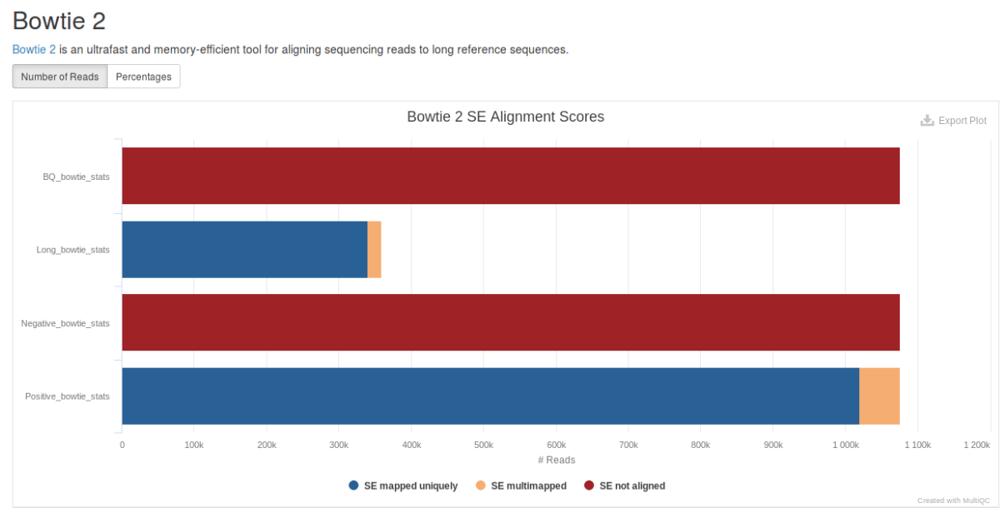
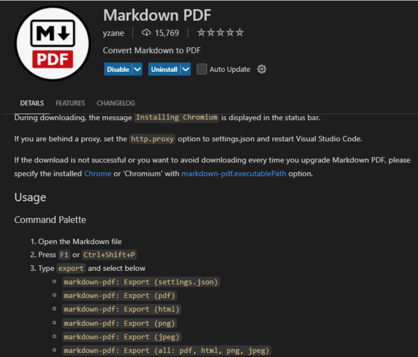

# 🧬 NGS Hackathon Challenge  
## Master in Research and Innovation in Biotechnology  
### Module: “Challenges in Biotechnology”

---
Date of the assignment: 	Tuesday 11/11/2025

Date assignment is due:	-------------- – 23.59h

Marking:	Challenge 1 — NGS Hackathon contributes 30% for Personalised Medicine section

---

### 🎯 **Introduction**

In this challenge, you will act as a **bioinformatician** analyzing **Illumina next-generation sequencing (NGS)** data.  
Your goal is not only to execute computational tools but to **understand, interpret, and improve** the quality of your analyses through evidence-based reasoning and iteration.  

This assessment simulates a real-world bioinformatics scenario where reproducibility, accuracy, and interpretation are key.  
Throughout the assignment, you will:
- Work with raw FASTQ files and identify quality issues.  
- Use standard bioinformatics tools (`FastQC`, `Cutadapt`, `Bowtie2`, `Samtools`, `MultiQC`).  
- Apply parameter optimization and critical thinking to improve results.  
- Document everything in **Markdown** for reproducibility.  

> 🧠 **Most important:** every section of your report must include a **strong biological interpretation** of the computational results.  
Explain what your observations mean in biological terms — e.g. sequencing quality, sample contamination, genomic complexity, or organismal biology.  
Interpretation will be the **most heavily weighted** criterion in grading.

---

### 📋 **Assessment Overview**

You will complete **three main tasks** (plus one extended exercise).  
Each builds on the previous one, representing together **30 % of the module grade**.

Deliverables:
- Submit a **single PDF report** (generated from Markdown) to ADI before the deadline.  
- Include all code, outputs (figures, tables, screenshots), and your biological interpretations.  
- Demonstrate iterative improvement, clear reasoning, and teamwork.  

---

### 🚀 **What Is a Hackathon?**

A **hackathon** is a collaborative and competitive event where participants solve technical problems in a short, intense timeframe.  
In bioinformatics, hackathons are used to develop or benchmark workflows, test algorithms, and promote open collaboration with real datasets.

Relevant examples:
- **NCBI/NIH Bioinformatics Hackathons** — organized by the National Center for Biotechnology Information (NIH/NCBI) to prototype genomic analysis pipelines:  
  🔗 [https://ncbiinsights.ncbi.nlm.nih.gov/tag/bioinformatics-hackathon/](https://ncbiinsights.ncbi.nlm.nih.gov/tag/bioinformatics-hackathon/)  
- **BioHackathon** - organized by DBCLS since 2008, focuses on standardization and interoperability of bioinformatics data and web services:
  🔗 [https://www.biohackathon.org/](https://www.biohackathon.org/) 
- **EMBL-EBI BioHackathon Europe** — focused on NGS interoperability and FAIR data standards:  
  🔗 [https://biohackathon-europe.org/](https://biohackathon-europe.org/)

In this course, you will participate in a **mini-hackathon**, where teams will compete to achieve the **best mapping performance** (highest alignment rate and lowest error) on the same dataset.  
Teamwork, creativity, reproducibility, and biological insight will determine success.

---

## 🧪 Assessment Tasks

---

### **Question 1 – Diagnosing and Re-mapping `Negative.fq`**

You were given a FASTQ file (`Negative.fq`) from a simulated whole-genome sequencing experiment.  
When reads were split using four barcodes (Negative, Positive, Long, BQ), the file `Negative.fq` showed **poor alignment**.

  

#### **Your task**
1. Identify **two plausible solution** for the poor mapping.  
2. Test both hypotheses by applying corresponding corrections or parameter changes.  
3. Re-map the reads against the reference genome.  
4. Choose which hypothesis is most accurate, justify your choice, and provide a biological interpretation.

#### **Hints**
- Use `less` and `fastqc` to inspect raw reads.  
- Try trimming options with `cutadapt` and different alignment modes with `bowtie2`.  
- Evaluate performance with `samtools stats`, `samtools flagstat`, and `multiQC`.  

#### **Include in your report**
- All commands used.  
- Description of both initial hypotheses and solutions.  
- Identification of the correct cause and justification with evidence.  
- Table comparing both alignments (mapping %, error rate, number of reads, multimapping).  
- **Strong biological interpretation** of what these findings imply about your sequencing data and experiment.  

---

### **Question 2 – Quality Trimming and Re-mapping `BQ.fq`**

The dataset `BQ.fq` also produced null alignment rates.  
Your objective is to **improve mapping accuracy and yield** through quality filtering and parameter optimization.

#### **Steps**
- Inspect raw quality and adapter content with `fastqc`.  
- Use `cutadapt` to trim adapters, low-quality tails, and short reads.  
- Re-map cleaned reads with `bowtie2`, testing different parameter sets.  
- Compare **alignment rate**, **error rate**, **multimaping**, and **number of reads** using `samtools` and `multiQC`.  
- Reflect on the trade-off between **alignment rate** (quantity) and **alignment accuracy** (quality).  

#### **Include in your report**
- All trimming and mapping commands.  
- Tables with mapping statistics.  
- Explanation of how trimming thresholds affected results.  
- Discussion of which parameters produced biologically most meaningful results.  
- **Biological interpretation:** e.g., does quality trimming remove contamination, low-quality regions, or artifacts from sample prep?

---

### **Question 3 – 🧠 Hackathon Challenge (“The Box”)**

This is the **competitive hackathon** section.  
You will use your optimized workflow from Question 2 to produce the **best possible mapping** for the `BQ` dataset.  

#### **Rules**
- You may use either standard commands or your **own developed scripts or pipelines** (custom Bash scripts, or Python wrappers).  
- Creativity and reproducibility are encouraged — clearly document your workflow so that others could reproduce your results.  
- Each team must submit one final short **command or script BOX** and final statistics.  

#### **Deliverables**
- A **BOX** (or script snippet) containing your final `cutadapt` and `bowtie2` commands or full custom pipeline.  
- Final **mapping table** with alignment %, mismatches/error rate, and total reads.  
- Short (≤ 300 words) explanation of your optimization strategy and how it improved mapping results.  
- A **biological interpretation** of what your optimizations imply about the sample or sequencing process.

#### **Example BOX**
> ```{bash}
> 
> # Cutadapt trimming
> cutadapt -q ¿¿¿¿¿ -m ¿¿¿¿¿ -a ¿¿¿¿¿ -A ¿¿¿¿¿¿¿?????? 
> 
> # Bowtie2 alignment
> bowtie2 -x reference_genome -1 BQ_trimmed_R1.fastq -2 BQ_trimmed_R2.fastq \
>   ¿¿¿¿¿ -p ?????? -S BQ_aligned_tried?.sam
> 
> ```

#### **Evaluation criteria**
1. Highest % of mapped reads.  
2. Lowest mismatch/error rate.  
3. Lowest multimapping reads.
4. Workflow clarity and reproducibility.  
5. Quality of **biological interpretation**.  

---

### **Question 4 – Exploring SAM Flags (Advanced Task)**

> ¡¡ This is a non required questions. Student and groupd completing this task will get extra points but will not compute on the total mark points!!

Use **`samtools`** to split and inspect your alignment file (`BQ_aligned.sam` or `.bam`) based on mapping characteristics.

#### **Tasks**
a) Split into two files:
- Reads mapping to multiple locations (multimapping).  
- Reads mapping uniquely.  

b) Split into:
- Unmapped reads.  
- Mapped reads.  

c) Explain how you could achieve (b) directly using `bowtie2` parameters instead.  

d) Use **BLAST** to identify the origin of unmapped reads and summarise findings. Report your results.

🧩 **Bonus (optional, extra marks)**  
e) Split reads with **> 3 mismatches** vs **< 3 mismatches** and discuss whether these mismatches are biologically meaningful (e.g., real variants, errors, contamination).  
f) Separate **trimmed** from **untrimmed** reads and interpret differences.

#### **Hints**
- Use `samtools view -f` and `-F` for flag filtering.  
- Reference for flags: [https://broadinstitute.github.io/picard/explain-flags.html](https://broadinstitute.github.io/picard/explain-flags.html)  
- Combine `grep`, `awk`, or regular expressions for more complex filters.  

#### **Include**
- All filtering commands used.  
- Screenshots or tables showing your outputs.  
- Short answers to (c) and (d) with **biological interpretations**.

---

## 🗾 **Submission and Markdown Instructions**

Submit a **single PDF file** including:
- Code boxes and scripts.  
- Figures and screenshots.  
- Tables with summary statistics.  
- Written answers with explicit biological interpretation.

---

### 🗺️ **Creating Your Report in Markdown**

You can use Word or Google Docs, but **Markdown** is highly recommended for reproducibility.

#### 🔹 Option 1: **Visual Studio Code (VSC) + Extensions**
1. Open Visual Studio Code.  
2. Open the Extensions panel (`Ctrl + Shift + X`).  
3. Install:  
   - **Markdown All in One** → [link](https://open-vsx.org/vscode/item?itemName=yzhang.markdown-all-in-one)  
   - **Markdown PDF (yzane)** → [link](https://open-vsx.org/vscode/item?itemName=yzane.markdown-pdf)  
4. Create a file named `NGS_Hackathon_Report_{TEAM_NAME}.md`.  
5. Write using Markdown syntax:
   - `#` for titles  
   - ```bash … ``` for code blocks  
   - `` for figures  
6. To export: `Ctrl + Shift + P` → *Markdown PDF: Export (pdf)*.  
7. PDF will appear in the same folder.

🔌 Use `Ctrl + Shift + V` for live Markdown preview in VS Code.

  


#### 🔹 Option 2: [Dillinger.io](https://dillinger.io/)
1. Open [https://dillinger.io/](https://dillinger.io/).  
2. Write your Markdown text directly.  
3. Use the preview pane to visualise formatting.  
4. Export or print to **PDF** or **HTML**.  
5. Include figures as:  
   ``.


---

### 🔯 **Recommended Markdown Resources**
- [https://www.markdownguide.org/](https://www.markdownguide.org/)  
- [Markdown PDF (yzane)](https://open-vsx.org/vscode/item?itemName=yzane.markdown-pdf)  
- [Markdown All in One](https://open-vsx.org/vscode/item?itemName=yzhang.markdown-all-in-one)

