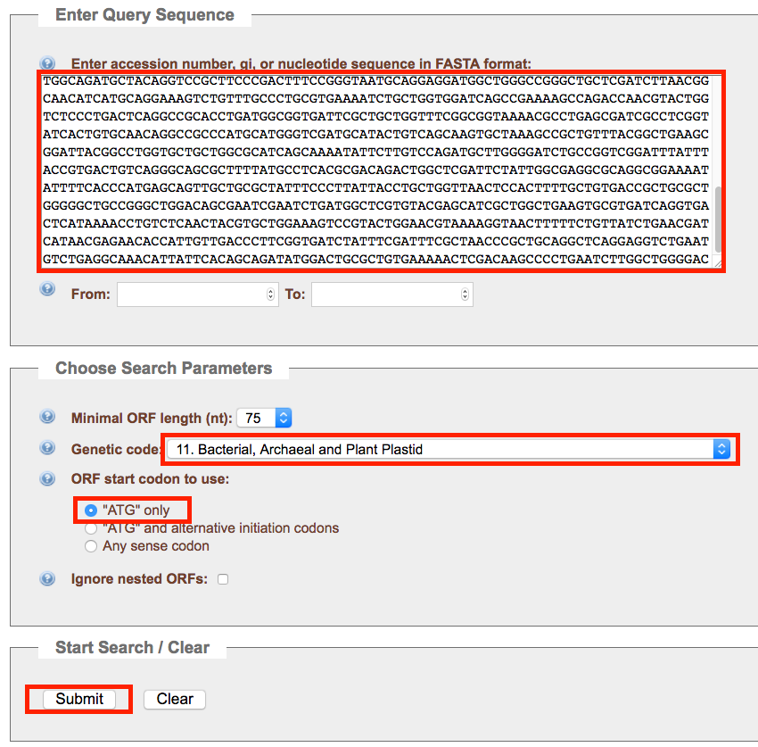
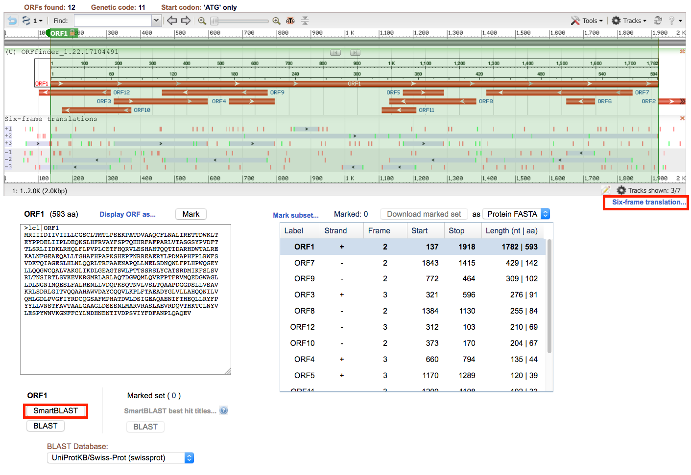
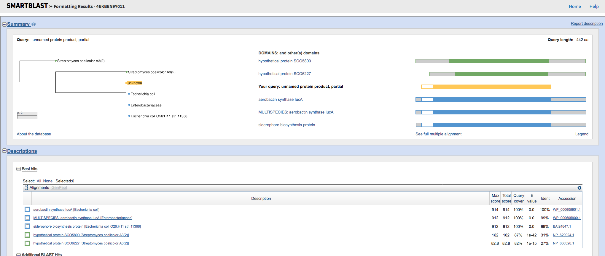
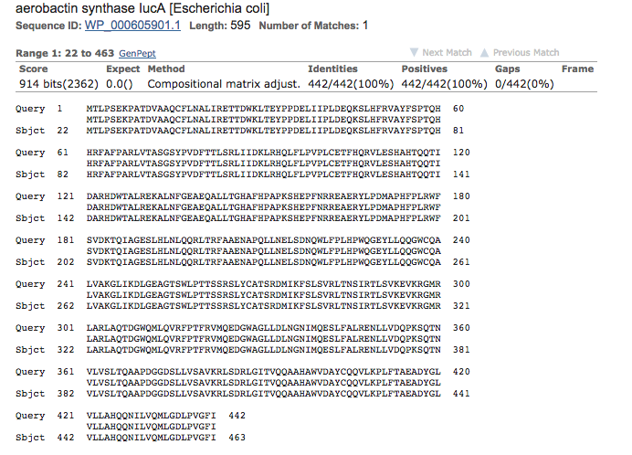
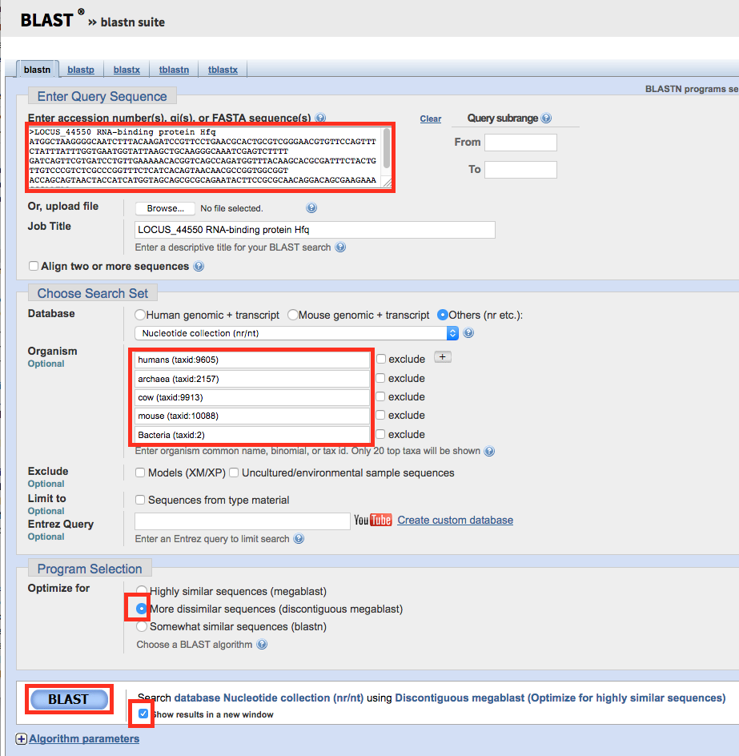
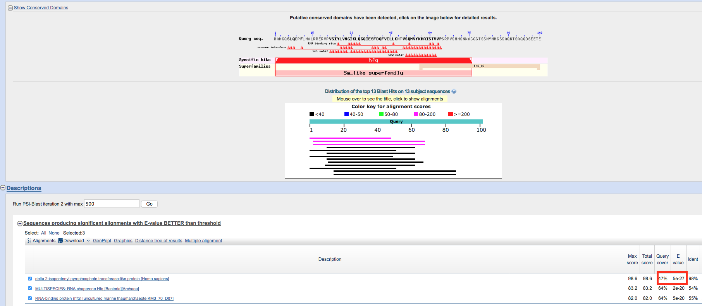
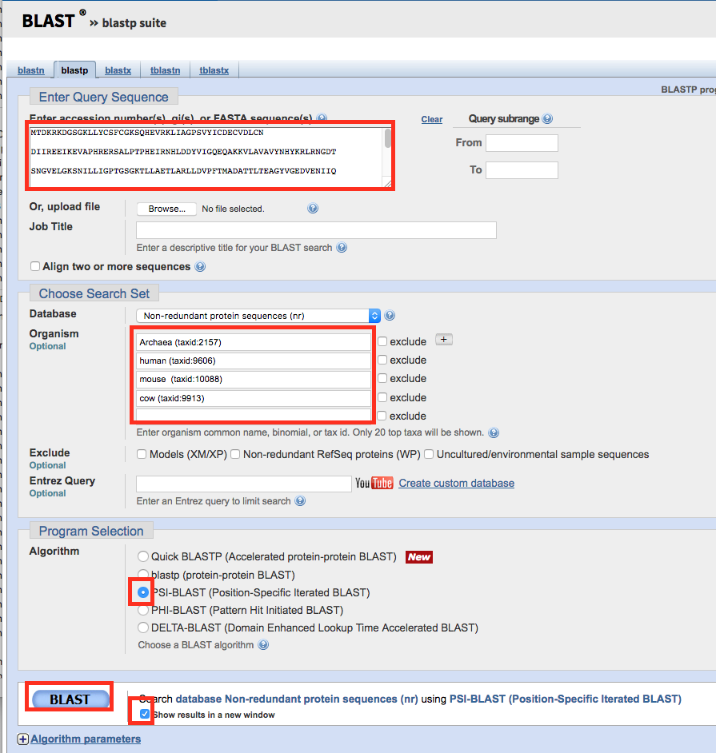
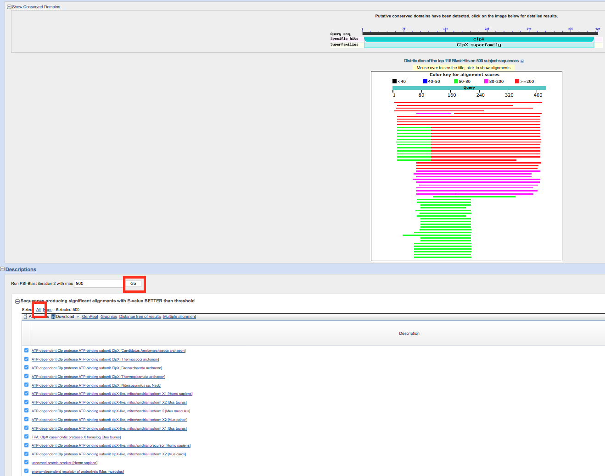
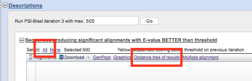
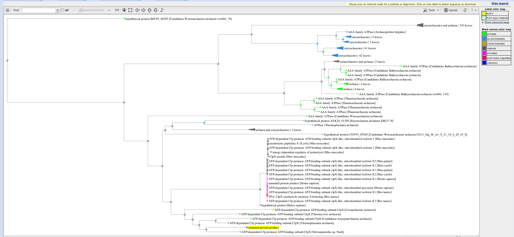

# BLAST tutorial  

Here, there is an additional BLAST tutorial as part of this practical. In this tutorial, we show you how to use a single hypothetical gene sequence (resulting from an ORF prediction) to run a BLAST search and predict what the function of this gene could be by looking at homologues retrieved with BLAST from a selection of other organisms.


### ORF Open Reading Frame prediction

Go to https://www.ncbi.nlm.nih.gov/orffinder/ and introduce below fasta sequence. You can also pick random sequence from "AFPN02.1_merge_consensus.fa" and try to predict open reading frames.


```
>Extracted fasta
ACGCAAGTGGCCAGCAGGACAGTGGTTTTTGGGGCGTATCTTCGATCCCAGGGGACATTTTAATGTTTCAACTCCATGTA
TTAATTGTGTTTATTTGTAAAATTAATTTATCTGACAATAACATTTCTTATTGATAATGAGAATCATTATTGACATAATT
GTTATTATTTTACTGTGTGGGAGCTGTTTGACTATGACCCTGCCCTCTGAAAAACCAGCCACAGATGTGGCTGCGCAGTG
CTTCCTGAATGCACTGATTCGTGAAACCACAGACTGGAAACTGACAGAATACCCGCCAGACGAATTGATCATCCCGCTGG
ATGAGCAGAAATCGCTCCATTTCAGAGTGGCTTATTTCTCCCCAACCCAGCATCACCGCTTTGCATTTCCTGCACGTCTG
GTCACGGCATCAGGCAGTTATCCTGTCGACTTTACCACTCTCTCCCGGCTTATTATTGATAAGCTACGGCATCAACTGTT
TCTGCCCGTTCCCCTCTGCGAAACTTTCCACCAGCGCGTGCTGGAAAGCCACGCCCATACGCAACAGACAATTGATGCCC
GTCATGACTGGACCGCCCTGCGTGAAAAAGCGTTGAATTTTGGCGAAGCTGAGCAGGCGCTGCTGACAGGACACGCTTTC
CACCCTGCGCCTAAGTCTCATGAACCGTTTAACCGGCGGGAGGCTGAACGCTACCTGCCTGATATGGCACCCCACTTCCC
ACTGCGGTGGTTTTCGGTGGATAAAACGCAAATCGCCGGTGAAAGTTTGCATCTCAACCTTCAACAGCGGCTGACGCGAT
TTGCCGCAGAGAATGCGCCTCAGTTACTCAACGAATTAAGTGACAACCAATGGCTGTTCCCGTTGCACCCGTGGCAGGGG
GAATATCTTTTGCAGCAGGGGTGGTGCCAGGCACTTGTTGCTAAAGGGCTGATTAAAGACTTAGGTGAGGCCGGCACGTC
GTGGCTGCCGACCACCTCTTCCCGTTCCCTCTACTGTGCCACCAGCCGCGATATGATCAAGTTCTCCCTGAGCGTACGGC
TGACCAACTCCATCCGTACTCTGTCCGTGAAAGAAGTGAAGCGTGGGATGCGCCTGGCACGCCTGGCTCAAACCGACGGC
TGGCAGATGCTACAGGTCCGCTTCCCGACTTTCCGGGTAATGCAGGAGGATGGCTGGGCCGGGCTGCTCGATCTTAACGG
CAACATCATGCAGGAAAGTCTGTTTGCCCTGCGTGAAAATCTGCTGGTGGATCAGCCGAAAAGCCAGACCAACGTACTGG
TCTCCCTGACTCAGGCCGCACCTGATGGCGGTGATTCGCTGCTGGTTTCGGCGGTAAAACGCCTGAGCGATCGCCTCGGT
ATCACTGTGCAACAGGCCGCCCATGCATGGGTCGATGCATACTGTCAGCAAGTGCTAAAGCCGCTGTTTACGGCTGAAGC
GGATTACGGCCTGGTGCTGCTGGCGCATCAGCAAAATATTCTTGTCCAGATGCTTGGGGATCTGCCGGTCGGATTTATTT
ACCGTGACTGTCAGGGCAGCGCTTTTATGCCTCACGCGACAGACTGGCTCGATTCTATTGGCGAGGCGCAGGCGGAAAAT
ATTTTCACCCATGAGCAGTTGCTGCGCTATTTCCCTTATTACCTGCTGGTTAACTCCACTTTTGCTGTGACCGCTGCGCT
GGGGGCTGCCGGGCTGGACAGCGAATCGAATCTGATGGCTCGTGTACGAGCATCGCTGGCTGAAGTGCGTGATCAGGTGA
CTCATAAAACCTGTCTCAACTACGTGCTGGAAAGTCCGTACTGGAACGTAAAAGGTAACTTTTTCTGTTATCTGAACGAT
CATAACGAGAACACCATTGTTGACCCTTCGGTGATCTATTTCGATTTCGCTAACCCGCTGCAGGCTCAGGAGGTCTGAAT
GTCTGAGGCAAACATTATTCACAGCAGATATGGACTGCGCTGTGAAAAACTCGACAAGCCCCTGAATCTTGGCTGGGGAC

```

Select bacterial genetic code. For ORF start codon to use, select "ATG" only and submit.



Select the longest ORF, show the six frame translation and SmartBlast.



Explore the BLAST phylogenetic tree and aligned sequence.







## BLAST algorithm


https://en.wikipedia.org/wiki/BLAST

Used to seach DNA or Protein sequences on biological databases (NCBI, ENSEMBL...). You can also create your own database to BLAST localy.


### BLAST nucleotide sequence

Go to https://blast.ncbi.nlm.nih.gov/Blast.cgi?PAGE_TYPE=BlastSearch

Insert Hfq fasta sequence - extracted from our consensus sequence - and select organism to perform BLAST (humans, archaea, cow, mouse, bacteria).
Select "discontiguous megablast" (selected for evolutive distant species) and "show results in a new window".

```
>LOCUS_44550 RNA-binding protein Hfq
ATGGCTAAGGGGCAATCTTTACAAGATCCGTTCCTGAACGCACTGCGTCGGGAACGTGTTCCAGTTTCTATTTATTTGGTGAATGGTATTAAGCTGCAAGGGCAAATCGAGTCTTTT
GATCAGTTCGTGATCCTGTTGAAAAACACGGTCAGCCAGATGGTTTACAAGCACGCGATTTCTACTGTTGTCCCGTCTCGCCCGGTTTCTCATCACAGTAACAACGCCGGTGGCGGT
ACCAGCAGTAACTACCATCATGGTAGCAGCGCGCAGAATACTTCCGCGCAACAGGACAGCGAAGAAACCGAATAA
```



Click on human alignment. Surprised on the level of conservation between Eukaryotes and bacteria!!!! :o




### BLAST protein sequence

Go to https://blast.ncbi.nlm.nih.gov/Blast.cgi?PAGE=Proteins

Insert ClpX protein fasta sequence - extracted from our annotated sequence - and select organism to perform BLAST (humans, archaea, cow, mouse).
Select "PSI-BLAST" (Position-Specific Iterated BLAST) and "show results in a new window".

```
> ATP-dependent protease ATP-binding subunit ClpX from AFPN02.1
MTDKRKDGSGKLLYCSFCGKSQHEVRKLIAGPSVYICDECVDLCN
DIIREEIKEVAPHRERSALPTPHEIRNHLDDYVIGQEQAKKVLAVAVYNHYKRLRNGDT
SNGVELGKSNILLIGPTGSGKTLLAETLARLLDVPFTMADATTLTEAGYVGEDVENIIQ
KLLQKCDYDVQKAQRGIVYIDEIDKISRKSDNPSITRDVSGEGVQQALLKLIEGTVAAV
PPQGGRKHPQQEFLQVDTSKILFICGGAFAGLDKVISHRVETGSGIGFGATVKAKSDKA
SEGELLAQVEPEDLIKFGLIPEFIGRLPVVATLNELSEEALIQILKEPKNALTKQYQAL
FNLEGVDLEFRDEALDAIAKKAMARKTGARGLRSIVEAALLDTMYDLPSMEDVEKVVID
ESVIDGQSKPLLIYGKPEAQQASGE

```



Select "All" and run 2nd PSI_BLAST Iteration.



Select "All" and "Distance tree of results".



Observe pylogenetic tree using only one gene!!




### Homologous paralogous  
  
https://www.ncbi.nlm.nih.gov/homologene  
  
  
http://pfam.xfam.org/family/PF00816  
  