    
[](https://codespaces.new/FairTeach/codespaces_NGS?quickstart=1)

[](https://github.com/codespaces)

    
# An introduction to Genome Comparison

This part of the document was written to help students understand the context of the third NGS practical and should be read ideally *before* starting to work on that practical. It contains the background of the problem and an outline of the steps we aim to follow to solve the problem.

### Background  

In 2011, a very infectious strain of *E. coli* spread through Germany. Nearly 4000 people were affected and over 50 people died as a result. In such cases, the focus is often on identifying potential drug targets among the genes of the new strain. In this practical, we carry out a genome annotation of this strain and examine the conservation of antibiotic-resistant genes in this and other strains of *E. coli*.


### A .- Obtaining a consensus sequence for the new strain 
  
We already have a file containing a number of long reads mapped to the *E. coli* reference genome (*Long.bam* from the previous practical. We can use the program `freebayes` to identify variants in the mapped sequences, i.e. positions in the reads that are different to the reference genome. The result is a VCF file containing a list of these variants. We can then use the program `vcf2fasta` to produce a consensus sequence (in fasta format), keeping the most likely nucleotide at each site where a variation is observed. Although variant calling in human sequences is a fairly complex process, the approach described here for bacteria is very easy to run for simple SNP calling. Note that this approach does not assume any ploidy (i.e. does not take into account different alleles arising from chromosomes of different origin in sexually reproducing organisms).
  
   
### B .- Annotating the consensus sequence
  
We now have a FASTA file of the most likely genomic sequence of our new strain **but we have no information on where the genes are in this sequence**. Hence, the next step is to annotate the consensus sequence using the server DFAST at: https://dfast.nig.ac.jp/dfc/

This server allows us to annotate prokaryotic genomic sequences using homology searches.
The result isa  a number of files containing the predicted annotation of genes in our genomic sequence (genbank, gff etc).
  
  
### C .- Producing a list of sequences for antibiotic-resistant genes
  
The next step is to identify antibiotic-resistant genes and examine whether they are present in our strain and other strains of *E. coli*. This part is slightly more complicated due to the various file tranformations required to get to the final list of fasta sequences.

We will gather antibiotic-resistant genes for our list from two sources:   
  
**1** - A list of relevant gene sequences has been obtained for you from an online resource (https://megares.meglab.org) and you simply need to clean it up and select a few terms as suggested in the practical guidelines.
  
**2** - A second list is created by searching the annotation of the strain we carried out in the previous step for terms referring to antibiotic resistance. This requires a bit more work as the original *gff* information must be turned into a *bed* file and finally the *fasta* file must be obtained from that, so there are several steps involved.
  
**3** - Finally, the two lists must be concatenated into one *fasta* file which will be used as input for the comparison between genomes carried out in the next step.
  
  
### D .- Comparing antibiotic-resistance genes across genomes using BRIG
   
In this part of the practical the BLAST Ring Image Generator (BRIG) is used to visualise the results of comparing antibiotic-resistant genes in our strain and other *E. coli* strains. The input will be the concatenated list of sequences we created in the section above.
Most of the work here is done to ensure that the final result will offer a nice visualisation of the comparison of genes across different *E. coli* strains.

### BLAST Tutorial 

We expect that all students were introduced to BLAST in advance. For anyone not familiar with BLAST or anyone wanting to refresh their memory, We has put together a short tutorial that shows you how to use a single hypothetical gene sequence (resulting from an ORF prediction) to predicting its function and finding its orthologues (and paralogues) in NCBI databases using BLAST.   
  

**End of the introduction**

*** 


# Practical Genome Comparison guidelines

## Set up your directory structure and working environment   

We will set a shortcut for the path where we keep the practical work for this set of sessions. We will then create a new directory for this practical and work in that directory.
  

```{bash, eval = FALSE}
# Set the path to your workspace
st_path=$PWD
# st_path="/workspaces/codespaces_NGS"

# Install MultiQC mamba in base environment for 
mamba install -y -n base firefox
# Create and Load conda environment with all the tools needed to carry on this practical.
mamba env create -f "${st_path}"/env/.environment_GC.yaml
# add the hook to your ~/.bashrc so every new shell is initialized automatically
echo 'eval "$(mamba shell hook --shell bash)"' >> ~/.bashrc
# apply it now in this session
source ~/.bashrc
# Activate environment
conda activate env_GC
# Cleaning index cache
mamba clean --all --yes

# Create a new directory called results_GC (for Genome Comparison) for the current practical.
mkdir "${st_path}"/course_materials/results_GC
cd "${st_path}"/course_materials/results_GC

# In that directory, create a directory called alignment and copy there the alignment Long.bam file created from the previous practical.
mkdir "${st_path}"/course_materials/results_GC/alignment
# Then change to the new alignment directory.
cd "${st_path}"/course_materials/results_GC/alignment/
cp "${st_path}"/course_materials/resources/Long.bam "${st_path}"/course_materials/results_GC/alignment/


```   
  
*** 
    
## A .- Obtain a consensus sequence for the new strain

We have a file containing a number of long reads mapped to the E. coli reference genome (*Long.bam* ) from the previous practical. We can use the program `freebayes` to identify variants in the mapped sequences with reference to the genome. The result is a VCF file containing a list of these variants. We can then use the program `vcf2fasta` to produce a consensus sequence (in fasta format), keeping the most likely nucleotide at each site where a variation is observed. **Create a variant call for all the aligned nucleotides. We will create Single Nucleotide Polymorphisms and frecuencies for each nucleotide aligned. Very easy to run for simple SNP calling. Does not assume any ploidy.**


```{bash, eval = FALSE}
# Change directory
cd "${st_path}"/course_materials/results_GC/alignment/

# Get the consensus sequence with freebayes
# Create a variant call for all aligned nucleotides. We will create Single Nucleotide Polymorphisms and frecuencies for each nucleotide aligned.
freebayes -f  "${st_path}"/course_materials/genomes/AFPN02.1/AFPN02.1_merge.fasta -p 1 Long.bam > Long.vcffile

# Examine the VCF file (to exit the 'less' viewer, just press 'q').
head -n 10 Long.vcffile

# TODO this failed on 2023!
# Get a consensus fasta file from the VCF file 
# Merge all the possible variants to a single sequence and keep the most probable nucleotide for each site. 
vcf2fasta -f  "${st_path}"/course_materials/genomes/AFPN02.1/AFPN02.1_merge.fasta -P 1 Long.vcffile -p AFPN02.1_consensus.fasta

# Rename consensus file
mv AFPN02.1_consensus.fastaunknown_AFPN02.1_merge:0.fa AFPN02.1_merge_consensus.fa

# Examine the resulting consensus fasta file (To exit less press 'q').
less AFPN02.1_merge_consensus.fa

# alternative not used
# samtools mpileup -uf "${st_path}"/course_materials/genomes/AFPN02.1/AFPN02.1_merge.fasta Long.bam | bcftools view -cg | vcfutils.pl vcf2fq > CONSENSUS.fq

```


**Note on fasta format**

Fasta records (for gene, transcript or protein) start with a `>` symbol followed by the header of the sequence.
The next line contains the sequence itself, for example:

```{bash, eval = FALSE}
>Sequence header
GTCACCAGCTGTCGCCCAGCAAAACGATGATAATGAGATCATAGTGTCTGCCAGCCGCAGCAATCGAACTGTAGCGGAGA
TGGCGCAAACCACCTGGGTTATCGAAAATGCCGAACTGGAGCAGCAGATTCAGGGCGGTAAAGAGCTGAAAGACGCACTG
GCTCAGTTAATCCCCGGCCTTGATGTCAGCAGCCAGAGTCGAACCAACTACGGTATGAACATGCGTGGCCGTCCACTGGT
TGTCCTGATTGACGGTGTGCGCCTCAACTCTTCACGTTCCGACAGCCGACAACTGGACTCTGTCGATCCTTTTAATATCG
ACCATATTGAAGTGATCTCCGGCGCGACGGCCCTGTACGGTGGCGGGAGTACCGGAGGGTTGATCAACATCGTGACCAAA
AAAGGTCAGCCGGAAACCATGATGGAGTTTGAGGCTGGCACAAAAAGTGGCTTTAACAGCAGTAAAGATCACGATGAGCG
CATTGCCGGTGCTGTCTCCGGCGGAAATGACCATATCTCCGGACGTCTTTCCGTGGCATATCAGAAATTTGGCGGCTGGT...
>Next record
GCGCAAACCACCTGGGTTATCGAAAATGCCGAACTGGAGCAGCAGATTCAGGGCGGTAAAGAGCTGAAAGAACTGTACGT...

```
  
The consensus fasta file we created should look like this:
  
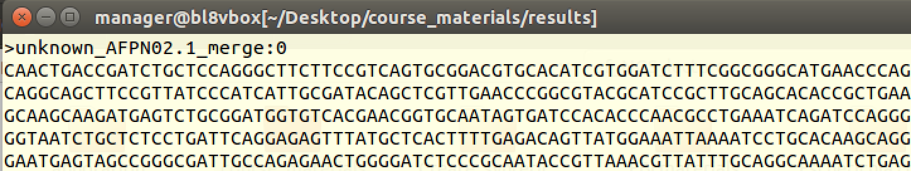

  
*** 

##  B .- Annotate the consensus sequence

We now have a FASTA file of the most likely genomic sequence of our strain BUT we have no information on where the genes are in this sequence. Hence, the next step is to annotate the consensus sequence using the server DFAST at: https://dfast.nig.ac.jp/dfc/

This produces a number of files containing the predicted annotation of genes in our genomic sequence (genbank, gff etc).

__You can try to annotate your consensus sequence with DFast. But for time efficiency we provide you with a pre-compiled annotation in ${st_path}/course_materials/resources/annotation__

If you want to repeat the annotation, go to the server, browse to your consensus sequence, provide a job title and your email address. Select `E. coli` additional DB, `100` minimum sequence length, Enable `HMM scan against TIGRFAM`, Enable `RPSBLAST against COG` and `Rotate/flip` the chromosome so that the dnaA gene comes first.
  

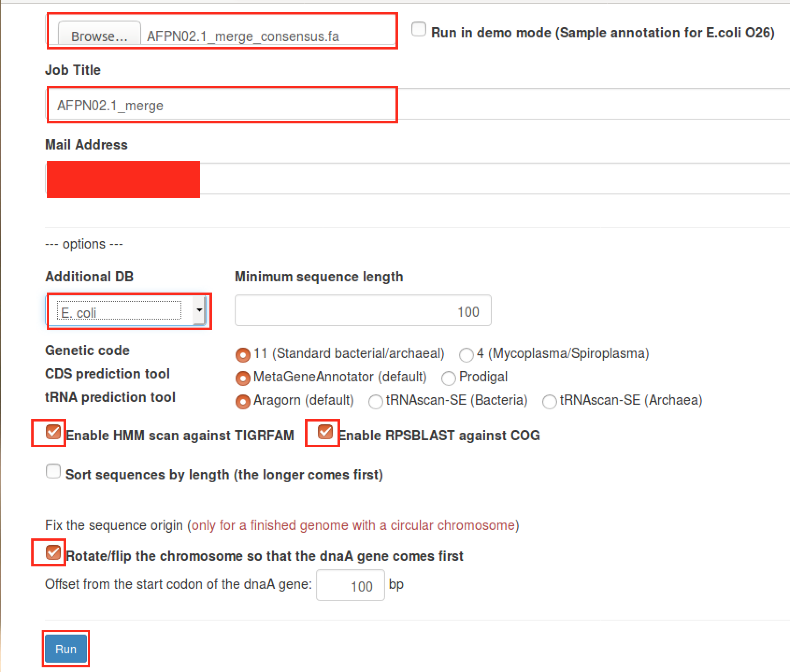

When the job is finished, download the `annotation.zip` file and move it to: `"${st_path}"/course_materials/results_GC/annotation`.

*However, we advise you to try this another time and use instead the annotation provided by us.*

```{bash, eval = FALSE}
# Go to results_GC directory
mkdir "${st_path}"/course_materials/results_GC/annotation
cd  "${st_path}"/course_materials/results_GC/annotation

# Get the annotated files from resources directory:
mv "${st_path}"/course_materials/resources/annotation.zip .

# Decompress annotation folder
unzip annotation.zip

```
  
### Annotation formats
  
We can take a quick look at the various files that DFast produced.

```{bash, eval = FALSE}
# Change directory to the annotation results
cd  "${st_path}"/course_materials/results_GC/annotation

## Explore the file formats present on the annotation folder

head annotation.gbk
head annotation.gff
head cds.fna
head features.tsv
head genome.fna
head protein.faa
head rna.fna
head statistics.txt

```
  
A quick explanation of the files produced is given below.
  
#### GenBank

Designed to store annotation, genomic position, features, metadata, taxonomy, sequence and reference authors.
Flat file format with unique identifiers for proteins and genes.

https://www.ncbi.nlm.nih.gov/Sitemap/samplerecord.html.


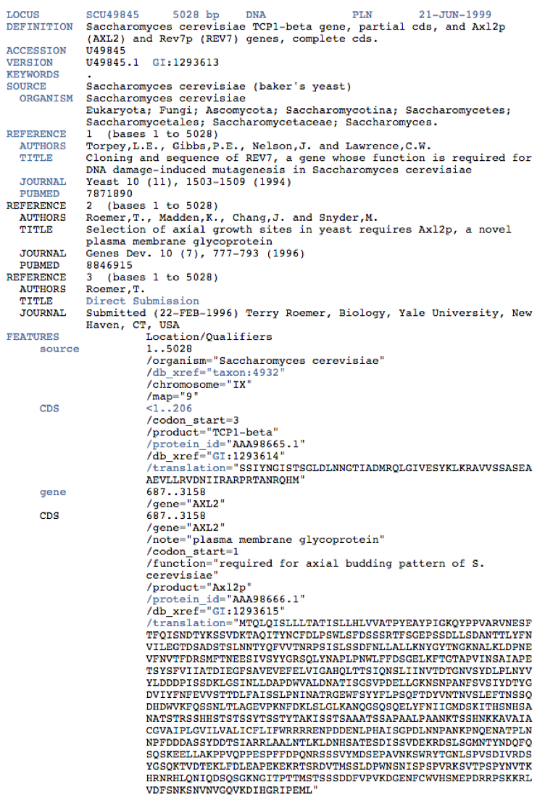


#### GFF annotation format   
  
Designed to store genomic position, annotation and metadata.
  
https://www.ensembl.org/info/website/upload/gff.html
  
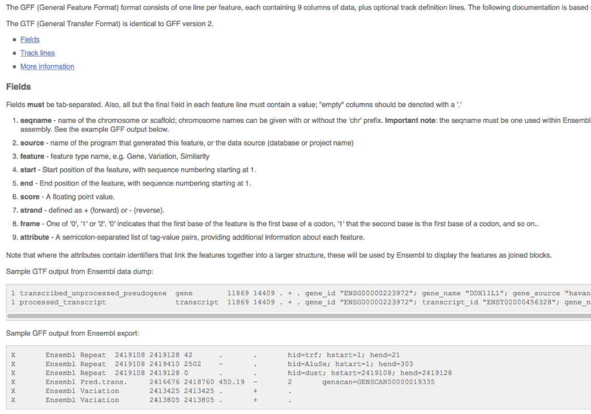
  
#### CDS.fna  
  
Multifasta format with protein sequence.  
    
#### features.tsc  
    
Table with genomic coordinates and minimal annotation.
  

*** 

## C .- Producing a list of sequences for antibiotic-resistant genes


Now we have annotated the sequence of our strain, the next step is to identify antibiotic-resistant genes and examine whether they are present in our strain and other strains of E. coli. This part is slightly more complicated due to the various file transformations required to get to the final list of fasta sequences.

We will gather antibiotic-resistant genes for our list from two sources:

A list of relevant gene sequences has been obtained for you from an online resource https://megares.meglab.org and you simply need to clean it up and select a few terms as suggested in the practical guidelines.

A second list is created by searching the annotation of the strain we carried out in the previous step for terms referring to antibiotic resistance. This requires a bit more work as the original gff information must be turned into a bed file and finally the fasta file must be obtained from that, so there are several steps involved.

Finally, *the two lists must be concatenated into one fasta file* which will be used as input for the comparison between genomes carried out in the next step.

You will need to use the cat command to concatenate files and direct the output to the screen or to a new file, so below is a brief reminder of how this works.

#### Examples of cat  
  
The command `cat` will concatenate files and redirect to standard output. We will be using this command below. 

https://www.gnu.org/software/coreutils/manual/html_node/cat-invocation.html  

  
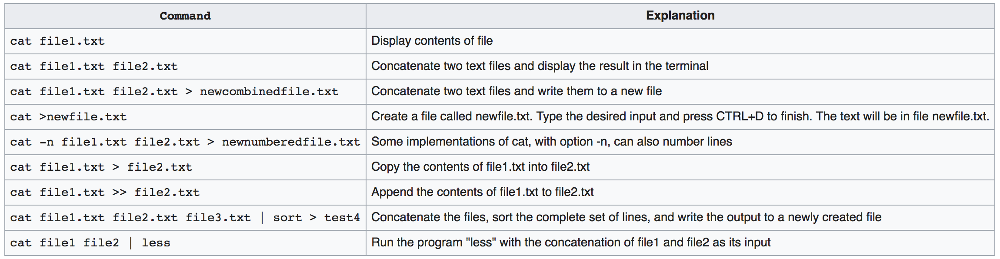   
  

We will now proceed to build the list of antibiotic-resistant genes.
  
  
## **C - 1** Antibiotic resistance genes from Meglab database


Antibiotic resistance genes have been downloaded for you from https://megares.meglab.org .  

We are going to extract genes from the downloaded file. We will __grep__ antibiotic terms and then clean the symbols "--" and the fasta header to obtain the final file: **selected\_antibiotic\_resistance\_genes\_meglab.fasta**  

To give you an overview of how we will do this, below is a schematic of the steps we will take, followed by the actual code: 

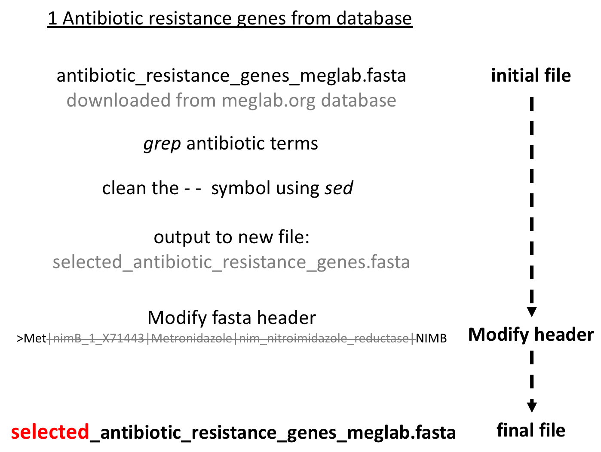
  
  
```{bash, eval = FALSE}
# Start off by creating an "antibiotics" directory in the results_GC directory and then
mkdir  "${st_path}"/course_materials/results_GC/antibiotics
cd  "${st_path}"/course_materials/results_GC/antibiotics
# copy the file we obtained from the database to your own directories.
cp "${st_path}"/course_materials/resources/antibiotic_resistance_genes_meglab.fasta .


# Read file obtained from meglab.org containing antibiotic resistance genes in fasta format.
less antibiotic_resistance_genes_meglab.fasta 

# Parse antibiotic genes
# Below we use cat in combination with other commands to progressively get what we want out of that file.

# Concatenate file (continue beyond end of line "\n")
# cat manual can be found here:
#    https://www.gnu.org/software/coreutils/manual/html_node/cat-invocation.html
cat antibiotic_resistance_genes_meglab.fasta | head -5

# The file contains data from many bacteria. We will extract the lines that contain
# the word "Escherichia" using grep
# grep manual https://www.gnu.org/software/grep/manual/grep.html
# Will output all the lines that contain 'Escherichia' string 
# Note the use of | to pipe between commands
cat antibiotic_resistance_genes_meglab.fasta | grep 'Escherichia'

# Grep a single word and count number of lines
# wc manual https://www.gnu.org/software/coreutils/manual/html_node/wc-invocation.html
cat antibiotic_resistance_genes_meglab.fasta | grep 'Escherichia' | wc -l

# Grep multiple words (-E) and count number of lines (total count 40 genes)
cat antibiotic_resistance_genes_meglab.fasta | grep -E 'Escherichia|carbapene|CEPH|NDM|QnrB9|Metronidazole' | wc -l

# Grep multiple words and output also next line -nucleotide sequence (-A1)
cat antibiotic_resistance_genes_meglab.fasta | grep -A1 -E 'Escherichia|carbapene|CEPH|NDM|QnrB9|Metronidazole' | wc -l

# We have more than double the number of results
cat antibiotic_resistance_genes_meglab.fasta | grep -A1 -E 'Escherichia|carbapene|CEPH|NDM|QnrB9|Metronidazole'

# Inspect output!! What is there? We note that the line containing "--" is included in the output.
# We will need to remove it and will do so below using "sed".

```

#### Manipulating text with sed

`sed` manual https://www.gnu.org/software/sed/manual/sed.html

```{bash, eval = FALSE}
# Let's see quickly how sed substitution works

# Print a string
echo "line to play with sed substitute"

# substitute "play" string
# substitute in sed have the following patern 's/patern_to_search/substitute_to/g'. Note s (substitute) and g at the end (global)
# Substitute play with learn
echo "line to play with sed substitute" | sed 's/play/learn/g'
# Substitute space with _
echo "line to play with sed substitute" | sed 's/ /_/g'
# Substitute space with nothing
echo "line to play with sed substitute" | sed 's/ //g'

```

  
Continuing the editing of file with antibiotic resistance genes from database
  
``` {bash, eval = FALSE}
# Make sure we are in the right directory.
cd "${st_path}"/course_materials/results_GC/antibiotics

# To remove the "--" separator, we use the sed command:
# sed manual https://www.gnu.org/software/sed/manual/sed.html

cat antibiotic_resistance_genes_meglab.fasta | grep -A1 -E 'Escherichia|carbapene|CEPH|NDM|QnrB9|Metronidazole' | sed '/^--$/d' | wc -l

# Let's see what we just did...
# We are using regular expressions (abbreviated to regex) to search 
# (/whatever in between forward slashes/) for '--' at the start of the 
# line (denoted by '^') and at the end of the line (denoted by '$').
# Regex are quite complex even for computer scientists and are out of the scope of this tutorial, 
# but if you want to learn more:
# manuals https://en.wikipedia.org/wiki/Regular_expression
# manual and try it https://medium.com/factory-mind/regex-tutorial-a-simple-cheatsheet-by-examples-649dc1c3f285
# test your regex https://regexr.com/

# This time we have 80 lines so we can redirect output (>) to a new file
cat antibiotic_resistance_genes_meglab.fasta | grep -A1 -E 'Escherichia|carbapene|CEPH|NDM|QnrB9|Metronidazole' | sed '/^--$/d' > selected_antibiotic_resistance_genes_meglab.fasta


# Let's now inspect the headers of this fasta file:
head -n 1 selected_antibiotic_resistance_genes_meglab.fasta

# output is: ">Met|nimB_1_X71443|Metronidazole|nim_nitroimidazole_reductase|NIMB"
# This fasta header contains more information that we need plus it will be 
# cumbersome to use later on.
# We will need to edit it.  
# We need to keep only the ">" fasta symbol, the first gene acronym "Met" 
# and the antibiotic family "NIMB"

# We will use awk specifying "|" as a field/column separator "FS" and then print the 
# first element $1 and the last element $NF
# Do you notice the difference?
cat selected_antibiotic_resistance_genes_meglab.fasta | awk 'BEGIN {FS="|"}  {if(/^>/) print $1 "_" $NF }' | head -n 1

# We output the result to temp.fasta using (>)
cat selected_antibiotic_resistance_genes_meglab.fasta | awk 'BEGIN {FS="|"} {if(/^>/) {print $1 "_" $NF}  else {print $1}}' > temp.fasta

# and move "temp.fasta" file to "selected_antibiotic_resistance_genes.fasta"
mv temp.fasta selected_antibiotic_resistance_genes_meglab.fasta
# mv: overwrite ‘selected_antibiotic_resistance_genes_meglab.fasta’? y
# Answer "y" to "mv: overwrite ‘selected_antibiotic_resistance_genes_meglab.fasta’?"

# Inspect final selected antibiotic resistance genes downloaded from meglab.org database
less selected_antibiotic_resistance_genes_meglab.fasta


```
  
    
##  **C - 2** Finding antibiotic genes in the predicted in the annotation
  
Starting from the annotation of our genome AFPN02.1 we will __grep__ antibiotic terms. Then we will transform the gff file to a bed file. We will use the bed file to retrieve the nucleotide sequence helped with BedTools. Finally we will clean the fasta header to obtain the file `present_in_AFPN02_antibiotic_resistance_genes.fasta`.

Starting from the annotation of our genome AFPN02.1 we will __grep__ antibiotic terms. Then we will transform the gff file to a bed file. We will use the bed file to retrieve the nucleotide sequence helped with BedTools. Finally we will clean the fasta header to obtain the file `present_in_AFPN02_antibiotic_resistance_genes.fasta`. The process is summarised in the diagram below:


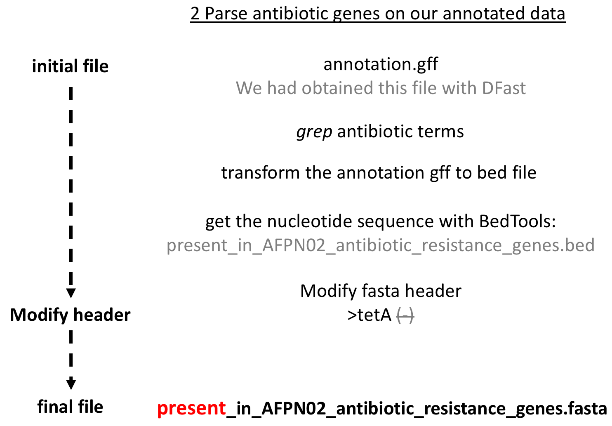

```{bash, eval = FALSE}

# Go to the annotation directory
cd  "${st_path}"/course_materials/results_GC/annotation

# AWK
# Awk is stand-alone scripting language. You can do incredible tasks with it in a single line. 
# Replicating the same with python will take several lines of code > perl > R
# If you want to refresh your memory of awk from the first practical, see here:
# awk manual https://en.wikipedia.org/wiki/AWK
# gawk manual https://www.gnu.org/software/gawk/manual/gawk.html

# The easiest awk call is to retrieve the 1st column. It will automatically detect field/column separator in a tabular text file. In this case it separates columns it on "blank space" (default)
awk '{print $1}' annotation.gff | head
# Compare it with the original. Note that with head we are only taking the first 2 lines (-n 2)
head -n 2 annotation.gff


# awk call to retrieve 1st and 2nd columns.
# On the print statement we include " " space as separator.
awk '{print $1 " " $2}' annotation.gff | head -n 2
# Compare it with the original. Note that with head we are only taking the first 3 lines (-n 3)
head -n 3 annotation.gff


# awk call, retrieve 1st and 2nd columns. We can supply an initial field separator of a tab via the command FS="\t" - sometimes this will be necessary to parse the text. Note that on the print statement we also separate fields with tab "\t".
awk 'BEGIN {FS="\t"} {print $1 "\t" $2}' annotation.gff | head -n 3
# Compare it with the original.
head annotation.gff | head -n 3

```
  
Next, we want to tranform the gff file to the bed format so let's take a quick look at bed below.
  
#### A note on the BED format

BED is flat file format separated with tab, used to store, retrieve and interact with genomic positions. Usually includes some annotation.
Check out the manual here: https://www.ensembl.org/info/website/upload/bed.html
  
```{bash, eval = FALSE}
Required fields:

The first three fields in each feature line are required:

    chrom - name of the chromosome or scaffold. Any valid seq_region_name can be used, and chromosome names can be given with or without the 'chr' prefix.
    chromStart - Start position of the feature in standard chromosomal coordinates (i.e. first base is 0).
    chromEnd - End position of the feature in standard chromosomal coordinates

chr1  213941196  213942363
chr1  213942363  213943530
chr1  213943530  213944697
chr2  158364697  158365864
chr2  158365864  158367031
chr3  127477031  127478198
chr3  127478198  127479365
chr3  127479365  127480532
chr3  127480532  127481699

Optional fields

Nine additional fields are optional. Note that columns cannot be empty - lower-numbered fields must always be populated if higher-numbered ones are used.

    name - Label to be displayed under the feature, if turned on in "Configure this page".
    score - A score between 0 and 1000. See track lines, below, for ways to configure the display style of scored data.
    strand - defined as + (forward) or - (reverse).
    thickStart - coordinate at which to start drawing the feature as a solid rectangle
    thickEnd - coordinate at which to stop drawing the feature as a solid rectangle
    itemRgb - an RGB colour value (e.g. 0,0,255). Only used if there is a track line with the value of itemRgb set to "on" (case-insensitive).
    blockCount - the number of sub-elements (e.g. exons) within the feature
    blockSizes - the size of these sub-elements
    blockStarts - the start coordinate of each sub-element

chr7  127471196  127472363  Pos1  0  +  127471196  127472363  255,0,0
chr7  127472363  127473530  Pos2  0  +  127472363  127473530  255,0,0
chr7  127473530  127474697  Pos3  0  +  127473530  127474697  255,0,0
chr7  127474697  127475864  Pos4  0  +  127474697  127475864  255,0,0
chr7  127475864  127477031  Neg1  0  -  127475864  127477031  0,0,255
chr7  127477031  127478198  Neg2  0  -  127477031  127478198  0,0,255
chr7  127478198  127479365  Neg3  0  -  127478198  127479365  0,0,255
chr7  127479365  127480532  Pos5  0  +  127479365  127480532  255,0,0
chr7  127480532  127481699  Neg4  0  -  127480532  127481699  0,0,255


```   
   
#### Transform GFF format to bed  
   
```{bash, eval = FALSE}
# Go to the annotation directory
cd  "${st_path}"/course_materials/results_GC/annotation

# Grep lines with "antibiotic"
cat annotation.gff | grep -E 'antibiotic'

# Transform gff file to bed 6 columns
# Grep lines with "antibiotic" string and transform to bed format
# on the print statement we can include any string between quotes like I'm doing with "sequence1"
cat annotation.gff | grep -E 'antibiotic' | awk 'BEGIN {FS="\t"};  {print "sequence1" "\t" $4 "\t" $5 "\t" $3 "\t" $6 "\t" $7}'


# Grep several antibiotic's names and transform to bed with awk.

# Note use of split command. We are spiting field $9 (9th) into everything that start with "=" and end with ";".
# We are trying to capture the gene name that has the format ";gene=gene_name;".
# Then we assign captured array to "captured" variable and require that the split has more than 10 elements ">=10".
# Then we select the 12th element "captured[12]", which equals to gene acronym.
# We also retrieve the "captured[4]" element that will be the protein product.
cat annotation.gff | grep -E 'antibio|penici|lactama|macrolide|tetracycli|streptomycin|sulfonamide|ampheni|tetracycline|Tellurite|nalidixic' | awk 'BEGIN {FS="\t"}  split($9, captured, /[(=);]/) >=10  {print "sequence1" "\t" $4 "\t" $5 "\t" captured[12] "\t" captured[4] "\t" $7}' | head -n 5


# Send output to file.bed "present_antiotic_resistance_genes.bed"
cat annotation.gff | grep -E 'antibio|penici|lactama|macrolide|tetracycli|streptomycin|sulfonamide|ampheni|tetracycline|Tellurite|nalidixic' \
| awk 'BEGIN {FS="\t"}  split($9, captured, /[(=);]/) >=10  {print "sequence1" "\t" $4 "\t" $5 "\t" captured[12] "\t" captured[4] "\t" $7}' \
> present_in_AFPN02_antibiotic_resistance_genes.bed

# Move "present_in_AFPN02_antibiotic_resistance_genes.bed" o antibiotics/ folder
mv present_in_AFPN02_antibiotic_resistance_genes.bed  "${st_path}"/course_materials/results_GC/antibiotics

# Go to antibiotics directory
cd  "${st_path}"/course_materials/results_GC/antibiotics


# BedTools
# Get fasta sequence with bedtools
# Once we have the annotation and genomic position we need to include fasta sequence;
# for this task we will use bedtools.
# bedtools manual https://bedtools.readthedocs.io/en/latest/content/bedtools-suite.html
# bedtools getfasta manual https://bedtools.readthedocs.io/en/latest/content/tools/getfasta.html
bedtools getfasta -nameOnly -s -fi  "${st_path}"/course_materials/results_GC/annotation/genome.fna -bed present_in_AFPN02_antibiotic_resistance_genes.bed -fo present_in_AFPN02_antibiotic_resistance_genes.fasta

# Note addition of nucleotide sequence
head -n 1 present_in_AFPN02_antibiotic_resistance_genes.bed
head -n 2 present_in_AFPN02_antibiotic_resistance_genes.fasta


# Realize that we have ">tetA(-)" in the header of the fasta.
head -n 1 present_in_AFPN02_antibiotic_resistance_genes.fasta

# We need to modify the header to end up with ">tetA" only. 
# (i.e. just the fasta beginning ">" and gene symbol "tetA")
# This can be done with another sed one-liner job.
# Find "(" -  parentheses. Then match anything (.) zero or more times (*) and substitute with nothing.
cat present_in_AFPN02_antibiotic_resistance_genes.fasta | sed 's/(.*//g' > temp.fasta

# Move the temporal file to present_in_AFPN02_antibiotic_resistance_genes.fasta
mv temp.fasta present_in_AFPN02_antibiotic_resistance_genes.fasta

```

**!!!Not needed!!! But if need to clean gene symbol you can follow this code**
```{bash, eval = FALSE}

# Realise that we have ">tetA::sequence1:66570-67769(-)" in the header of each fasta.
head -n 1 present_in_AFPN02_antibiotic_resistance_genes.fasta

# We need to modify it to ">tetA" only. Just the fasta beginning ">" and gene acronym "tetA".
# This another sed one-liner job
# Find "::" - since colon is special character for regex, we need to 'escape' them with forward slash (\:\:). The '\' tells the regex interpreter that the following character is to be interpreted literally, rather than as a regex command.
# Then match anything (.) zero or more times (*)
cat present_in_AFPN02_antibiotic_resistance_genes.fasta | sed 's/\:\:.*//g' > present_in_AFPN02_antibiotic_resistance_genes_acronym.fasta

# Modify file after cleaning
mv present_in_AFPN02_antibiotic_resistance_genes_acronym.fasta present_in_AFPN02_antibiotic_resistance_genes.fasta

# Move all the antibiotic files to antibiotic folder
mv present_in_AFPN02_antibiotic_resistance_genes*   "${st_path}"/course_materials/results_GC/antibiotics

```


## **3** Merge the two fasta files of antibiotics

Finally we will merge **selected** genes from the meglab database and those that we have queried from the annotation (**present**) in a final file: **"final\_comparison\_antibiotics.fasta "**.

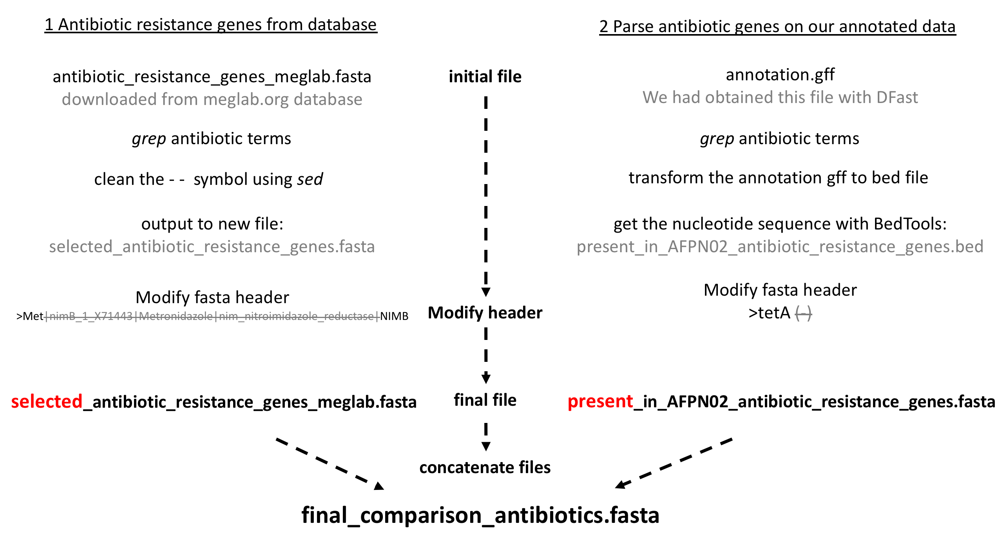


```{bash, eval = FALSE}
cd "${st_path}"/course_materials/results_GC/antibiotics


# Merge antibiotic files.
# Present in AFPN02.1 strain "present_in_AFPN02_antibiotic_resistance_genes.fasta"
# Some more resistance genes captured and cleaned from meglab web-server "selected_antibiotic_resistance_genes_meglab.fasta"
cat present_in_AFPN02_antibiotic_resistance_genes.fasta selected_antibiotic_resistance_genes_meglab.fasta > final_comparison_antibiotics.fasta

# Copy all the new files to wholeGenomeExamples folder
cp final_comparison_antibiotics.fasta  "${st_path}"/course_materials/genomes/wholeGenomeExamples

```

  
*** 
  
## D .-Compare antibiotic-resistance genes across genomes using BRIG

In this part of the practical the BLAST Ring Image Generator (BRIG) is used to visualise the results of comparing antibiotic-resistant genes in our strain and other *E. coli* strains. The input will be the concatenated list of sequences we created in the section above.
Most of the work here is done to ensure that the final result will offer a nice visualisation of the comparison of genes across different *E. coli* strains.

```
BLAST Ring Image Generator (BRIG): simple prokaryote genome comparisons, Nabil-Fareed Alikhan, BMC Gennomics 2011.

https://bmcgenomics.biomedcentral.com/articles/10.1186/1471-2164-12-402

```

#### BRIG manual

```
https://www.dropbox.com/s/xbuh9fetzmu630g/BRIGMANUAL.pdf?dl=0

BRIG http://sourceforge.net/projects/brig/

```

### Run and set-up BRIG
    
To run BRIG from the command-line, we need to:

1. Navigate to the unpacked BRIG folder in a command-line interface (terminal, console, command prompt).
2. Run `java -Xmx1500M -jar BRIG.jar`


  
```{bash, eval = FALSE}

# Create folder to output BRING results
mkdir -p  "${st_path}"/course_materials/results_GC/BRING_output

# Copy finalAFPN02.1.genome.fasta sequence to wholeGenomeExamples folder.
cp  "${st_path}"/course_materials/results_GC/annotation/genome.fna "${st_path}"/course_materials/genomes/wholeGenomeExamples/AFPN02.1.genome.fasta

# Decompress BRIG software
unzip "${st_path}"/course_materials/src/BRIG-0.95-dist.zip -d "${st_path}"/course_materials/src/

# Then reopen run BRIG software:
cd  "${st_path}"/course_materials/src/BRIG-0.95-dist
java -Xmx1500M -jar BRIG.jar


# Clone latest stable release on main
git clone https://github.com/esteinig/brick && cd brick

```
  

    


### Set-up the window size

To correctly display the genome comparison you should set the height and width pixel maps. Go to `Main window > Preferences > Image options` and change to `3000` pixels. *Save & close* your selection.

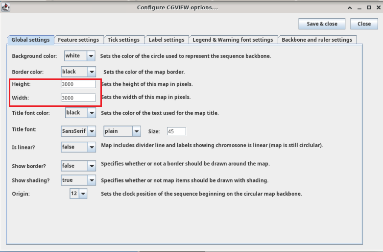

### Download BRIG additional data    
  
You can 
https://sourceforge.net/projects/brig/files/BRIG_examples.zip/download  
  
### Load data into BRIG

Initially, we need to select the reference sequence. The aim of this circular BLAST comparison is to search for homology between our reference sequence **final_comparison_antibiotics.fasta** obtained in the previous steps of this tutorial and our *E. coli* sequence from the Germany outbreak AFPN02.1 as well as other known *E. coli* bacterial genomes.

  
1. Select `/workspace/NGS_practicals/course_materials/genomes/wholeGenomeExamples/AFPN02.1.genome.fasta` as *Reference/Database sequence*. Users can use the browse button to traverse the file system. 
2. Set `/workspace/NGS_practicals/course_materials/genomes/wholeGenomeExamples/` as *Query sequence folder*
3. Press `Add data to pool`, this should load several items into the pool list.
4. Define an *Output folder* `/workspace/NGS_practicals/course_materials/results_GC/BRING_output`.
5. Click `Next`.

  
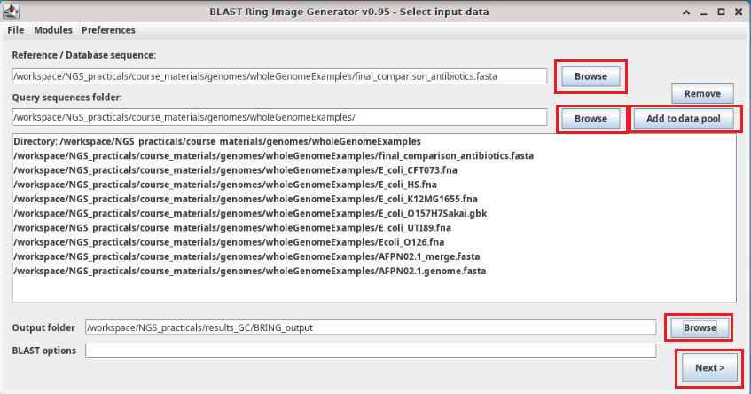  


### Configure rings  
  
1. Set **Spacer** as `50` nt.
2. Modify `null` in the **Legend text** for each ring. In this case include name `E_coli_CFT_073`
3. Select the required sequences (`E_coli_CFT_073.fna`) from the **Data pool** and click **Add data**.
4. Choose a **Ring colour**.
5. Set upper `90` and lower `70` **Identity thresholds**.
6. Click **Add new ring** and repeat these steps for each new ring (new strain in comparison).


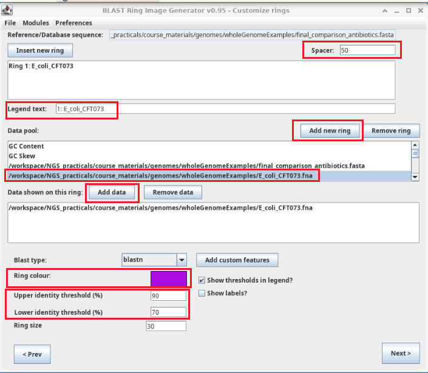

  
### Configure last ring German Outbreak E.coli AFPN02.1

We need to compare  the last annotation ring ( reference sequence -ring 4 below) against this ring (ring 3). If an annotated antibiotic genes is present in AFPN02.1 we will detect it as a colored red box in this ring with higher similarity appearing in bright red.

1. **Add new ring**.
1. Double click to select ring.
2. Modify **Legend text** to `German_Outbreak_AFPN02.1.`
3. Select `/workspace/NGS_practicals/course_materials/genomes/wholeGenomeExamples/AFPN02.1.genome.fasta` from the **Data pool** and click **Add data** to include the comparison sequence.
4. Choose **Ring colour**.
5. Set upper 90 and lower 70 **Identity thresholds**.


  
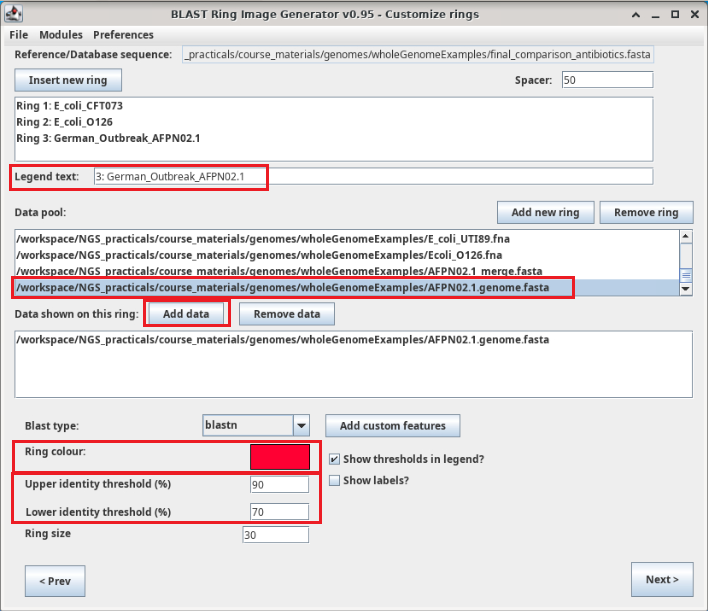  

  
### Configure annotation ring (Features ring)

Although we include our reference sequence as the very first of this BRIG analysis we will include an outside ring with the genes present on the **final_comparison_antibiotics.fasta**. To this end, we will **Add custom features** that will get information for each gene from the fasta header that we prepared during this practical. Now you may understand that reducing the fasta header was to have a clean legend and avoid clutter in the final plot.


1. **Add new ring** and leave **Legend text** empty.
2. Select **Add custom features**.

  
  
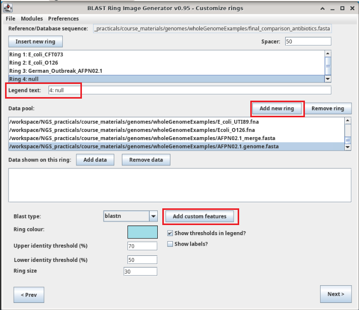  
  
After **Add custom features** window opened:

3. Double click on the empy **null ring**.
4. Select `Multi-FASTA` as **Imput data** sequence.
5. Change **Colour** to `alternating red-blue`.
6. **Draw features as** a `clockwise-arrow`.
7. Press `Add` (ONLY ONCE!!!!) and the annotation preview will be populated (blue square). If by mistake you added several times the annotation, you could **Clear all** or **Delete** annotation.
8. If you encounter errors try **Clear all features**.
9. Press **Close** and **Next** on the next window.


  
  
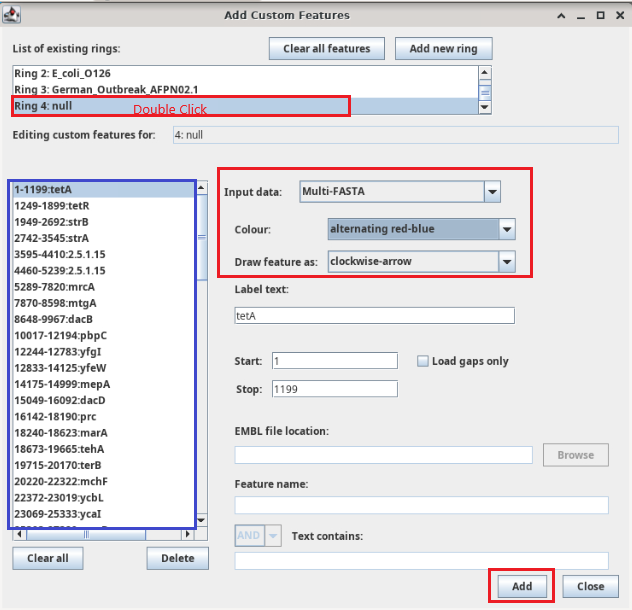  


### Finalize setup, perform BLAST and name output  


1. Select output format as png.
2. Rename as desired the **Image title** and **Output file** name.
3. Select **Re-do BLAST**.
4. **Submit**

  
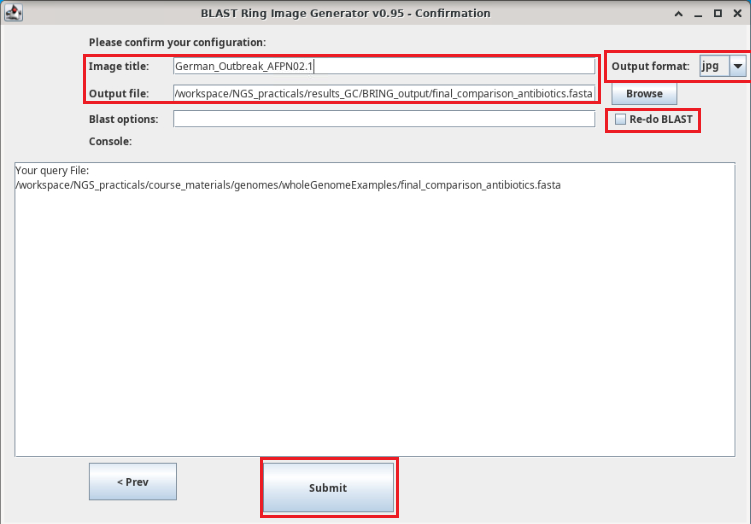   
    
      
## Antibiotic genes comparison   
  
You should obtain a similar circular plot as below. In this BLAST we are comparing the 7th annotation ring (with antibiotic resistance genes in blue and red) against  all the bacterial genomes included in the analysis. If you have a hit on any ring - colored by bacterial species - we should assume that a homologue of this gene is present on that bacterium (with a similarity ~70-90%). Then if we were asked for antibiotic treatment to kill the new strain we should recommend antibiotics that target genes that don't have a hit on the AFPN02.1 ring.


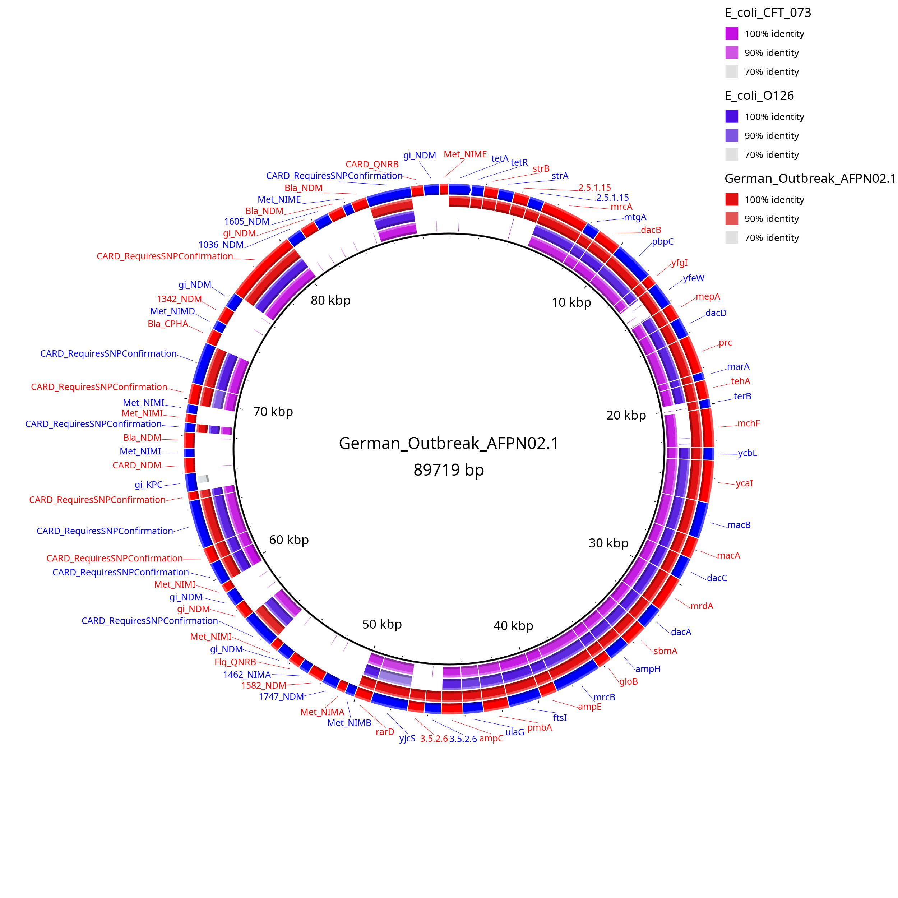

  
## Complete AFPN02.1 genomic comparison    
  

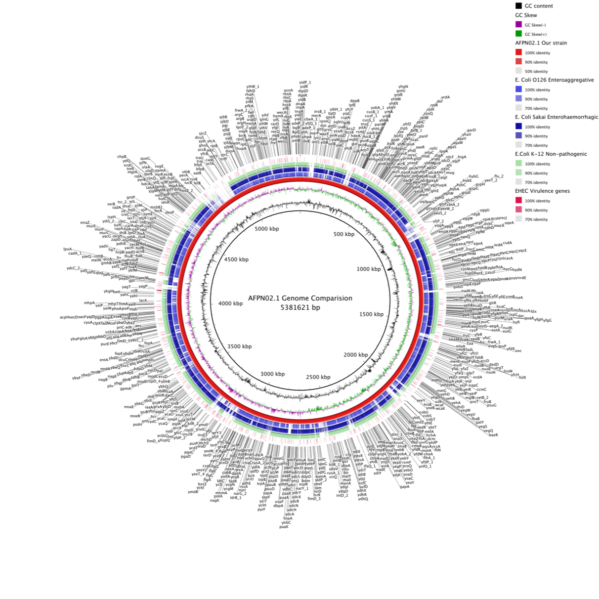  
  
  
