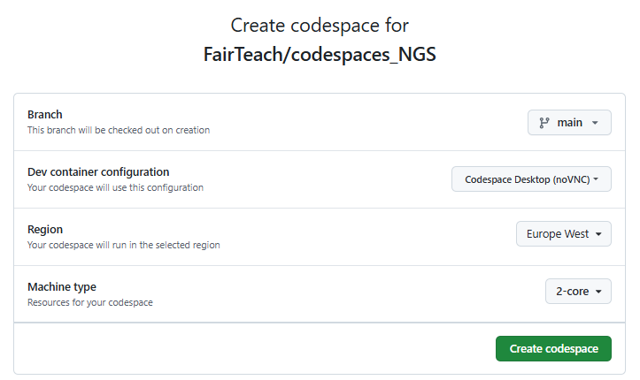
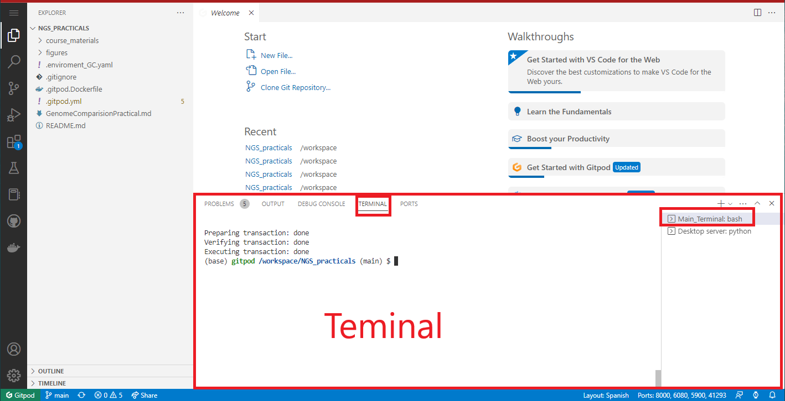
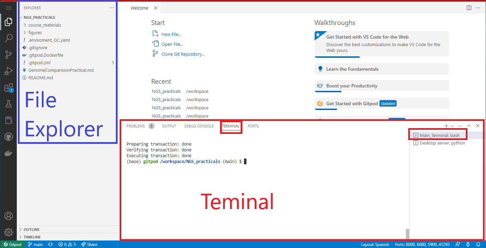
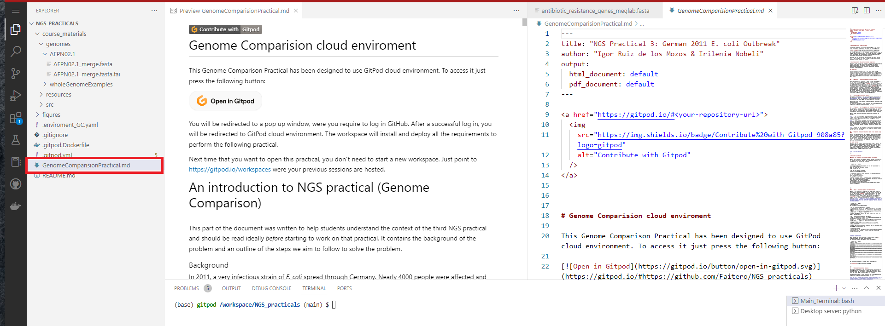
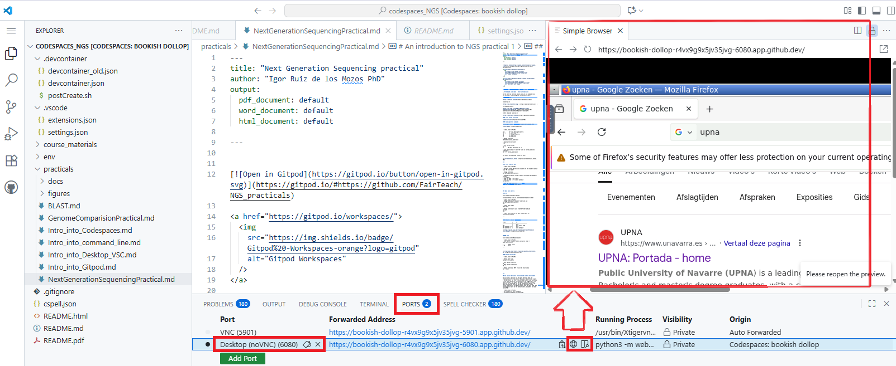

# Introduction to the Codespaces environment

This guide explains how to launch and operate the desktop-enabled Codespace that powers the NGS practicals. It replaces the legacy Gitpod instructions used in previous years.

GitHub Codespaces provides a fully managed, cloud-hosted development environment that mirrors the tooling we use in class. By default, verified GitHub Global Campus students receive up to **180 core-hours per month** (for example, 90 hours on a 2-core machine) and **20 GB of storage** across active codespaces—plenty for this module’s workloads. If you ever need more, you can adjust machine sizes or delete unused spaces from the [Codespaces dashboard](https://github.com/codespaces).

To deepen your understanding of Codespaces, explore these resources:
- [Codespaces documentation home](https://docs.github.com/en/codespaces)
- [Quickstart: Use GitHub Codespaces for the first time](https://docs.github.com/en/codespaces/getting-started/quickstart)
- [Codespaces video walkthroughs](https://resources.github.com/webcasts/topics/codespaces/)
- [Developing in Codespaces guide](https://docs.github.com/en/codespaces/developing-in-codespaces)

## Launching the Codespace from GitHub Web

1. Visit the repository at [FairTeach/codespaces_NGS](https://github.com/FairTeach/codespaces_NGS).
2. Select `<> Code` → `Create codespace on main` (or reuse an existing Codespace from the Codespaces dashboard).
3. Wait for the dev container build to complete. The process provisions Xfce, TigerVNC/noVNC, Miniforge+mamba, IGV desktop, and course-specific tooling.
4. Once VS Code connects, the desktop services start automatically under Supervisor. No additional setup is required.

> **Tip:** Reopen an existing Codespace for subsequent sessions to keep intermediate files. Starting a fresh Codespace restores the repository to its committed state.

## Launch the Codespace from Manuals and PDFs

Each exported manual and PDF includes two handy badges so you can jump into Codespaces directly from the document:

Use **Open in GitHub Codespaces** to create a brand-new workspace from the latest commit. This gives you a clean environment if you want to restart an exercise or if your previous Codespace has expired.

Choose **Continue GitHub Codespaces** to open your dashboard and resume an existing environment. Resuming keeps every file and intermediate result you produced earlier—bookmark the dashboard for quick access.

After launching a new Codespace via the badge, sign in to GitHub if prompted and confirm the default machine selection.

Once inside the desktop, start a terminal from `Applications → Terminal Emulator`, or continue working in the VS Code terminal.

Browse the repository through the left-hand `File Explorer`.

Right-click any practical Markdown (for example, `practicals/Intro_into_Codespaces.md`) and choose **Open Preview** to read the instructions alongside your terminal.

## Accessing the remote desktop
When the build finishes, Codespaces forwards the desktop ports automatically. Open the notification for `Desktop (noVNC)` on port 6080 and select **Open in Browser** to reach the Xfce desktop.

1. Open the **Ports** panel and locate port `6080` labelled `Desktop (noVNC)`.
2. Click the globe icon to open the noVNC session in a new browser tab.
3. Enter the VNC password `vscode` when prompted.

## Working with conda/mamba

- `mamba` is preinstalled; run `which mamba` or `mamba --version` to verify.
- Shells automatically source Miniforge (`/opt/miniforge/etc/profile.d/conda.sh`), so the base environment is active whenever you open a new terminal.
- Install extra packages with `mamba install -y <package>` (for example, `mamba install -y samtools`) and confirm with the corresponding `--version` command.

## Running IGV 

- Launch IGV desktop from any terminal with `igv &`; the application opens inside the noVNC desktop.
- Load data via `File → Load Genome from Server` or by browsing to files stored in the workspace.

---

For the complete repository overview and module links, see the root `README.md`.

You will also find the **Continue GitHub Codespaces** badge at the end of every manual as a quick way to reopen your existing workspace:

