# VS Code Desktop

based on [Gitpod documentation](https://www.gitpod.io/docs/vscode-desktop/)
[Gitpod ides-and-editors](https://www.gitpod.io/docs/references/ides-and-editors/vscode)

## Introduction Video
<iframe width="552" height="310" src="https://www.youtube.com/embed/kI6firDA0Bw" title="VS Code Desktop Support 🖥" frameborder="0" allow="accelerometer; autoplay; clipboard-write; encrypted-media; gyroscope; picture-in-picture; web-share" allowfullscreen></iframe>

## VS Code Desktop
With VS Code Desktop Support, you keep your local editor configurations1 and benefit from Gitpod’s high-spec servers & automated prebuilds. As usual, your code executes in an ephemeral Gitpod workspace, keeping each of your projects isolated from one another.

### Prerequisites
To open a Workspace directly from VS Code desktop, you’ll need to install and sign into the Gitpod extension, which you can find by searching for Gitpod inside of VS Code’s Extensions tab.

1. In VS Code, from the Activity Bar, click the Gitpod icon and then choose Sign in. Alternatively, open the Command Palette ( `Ctrl` + `Shift` + `P`) and type gitpod. Then select `Gitpod: Sign In`
Sign in VS Code from Gitpod viewSign in to VS Code Desktop from the Gitpod view


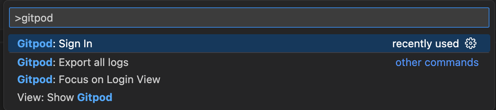
Code Desktop from the Command Palette

1. A dialog will appear asking permission to `open` your browser for authenticating VS Code with Gitpod. Click Open to proceed.
Open external website

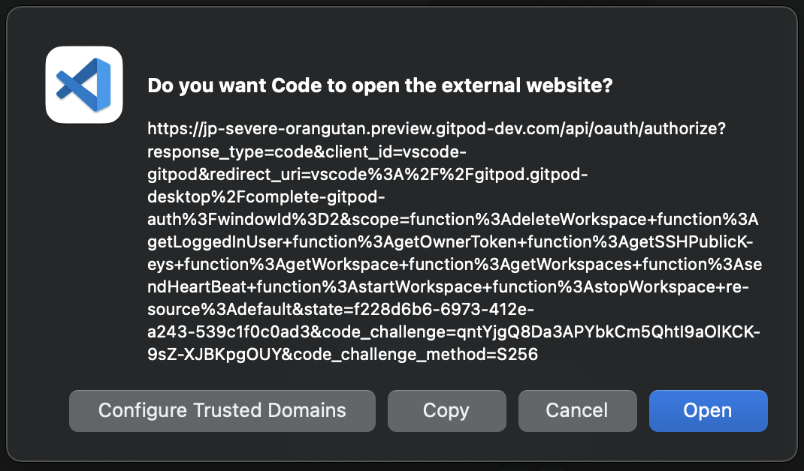 

3. Check your browser, you should see a Gitpod tab asking to authorize the VS Code Gitpod extension, click `Authrize`.

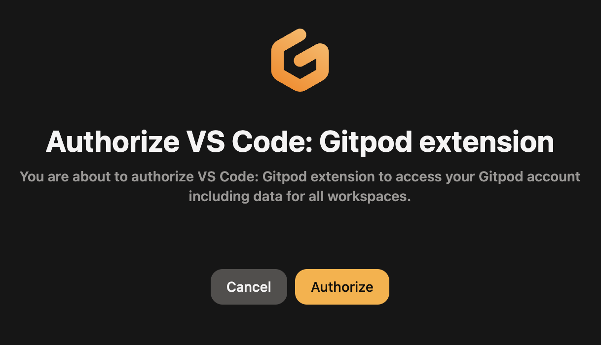
Authorize VSCode Gitpod extension

4. You will be redirected to VS Code and authentication should be completed. In the Activity Bar, click the Accounts icon and you should see your Gitpod account listed.

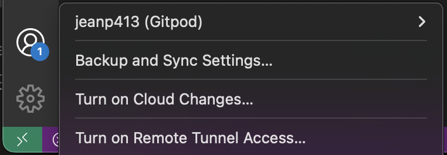
Authenticated VS Code Gitpod extension

### Open a workspace in VS Code Desktop
There are currently three supported ways to open a VS Code Desktop session connected to a Gitpod workspace, either by opening it from the Gitpod dashboard, choosing VS Code Desktop as your default preference, or directly from within VS Code Browser itself.

### Open VS Code Desktop from the Gitpod Dashboard
You can start a workspace with VS Code Desktop directly from Gitpod Dashboard. You can do that from by clicking on the New Workspace button. Then, you can select the context url, Editor and custom workspace class.


<figure><video onloadstart="this.playbackRate = 1.5;" class="shadow-medium w-full rounded-xl max-w-2xl mt-x-small" alt="Start Gitpod new workspace with options" src="/images/docs/new-workspace-start-with-options.webm" type="video/webm" controls="" playsinline="" autoplay="" loop=""></video> <figcaption>Open New Gitpod Workspace with VS Code Desktop • <a href="https://gitpod.io/workspaces">Gitpod Dashboard</a></figcaption></figure>
Open New Gitpod Workspace with VS Code Desktop • Gitpod Dashboard

### Open VS Code Desktop from VS Code Browser
1. Start a new Gitpod workspace
2. Open the command palette ( F1 or Ctrl + Shift + P)
3. Type “Open in VS Code” and hit Enter
You will now be redirected to VS Code Desktop.

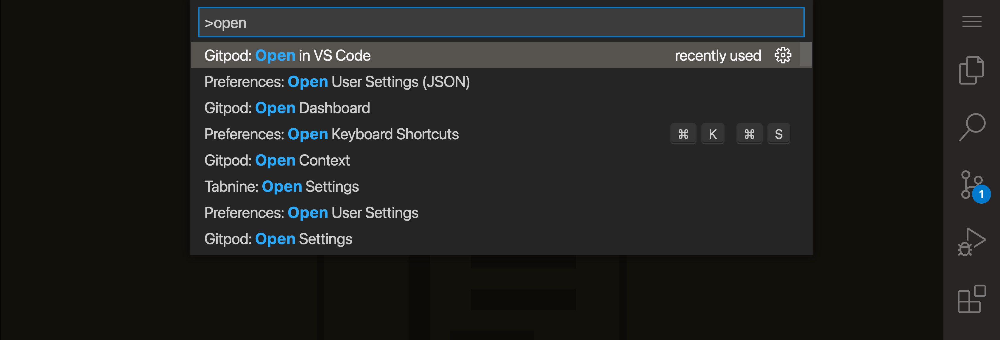
Open VS Code via the Command PaletteOpen VS Code via the Command Palette

### Open VS Code Desktop using your preferences
1. Navigate to your Gitpod preferences
2. Select “VS Code” (without the browser label)
3. Restart any running workspaces
When the workspace starts, you will be prompted to open VS Code Desktop. You can also access your workspace using VS Code Browser, or copy SSH credentials from this page.

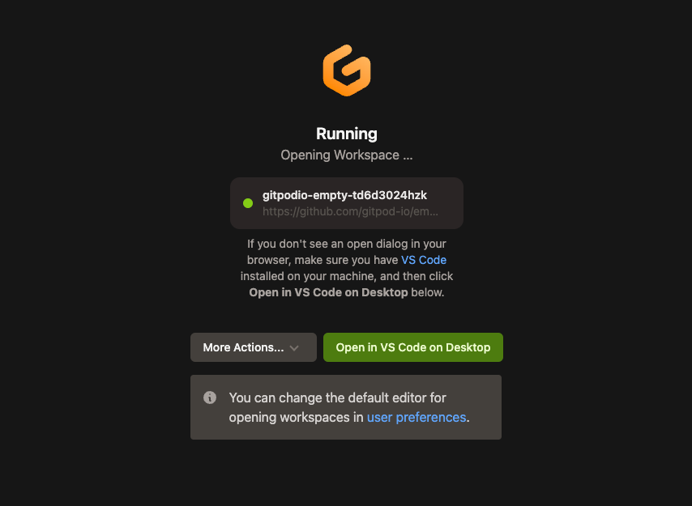

Open VS Code Desktop from the workspace start page

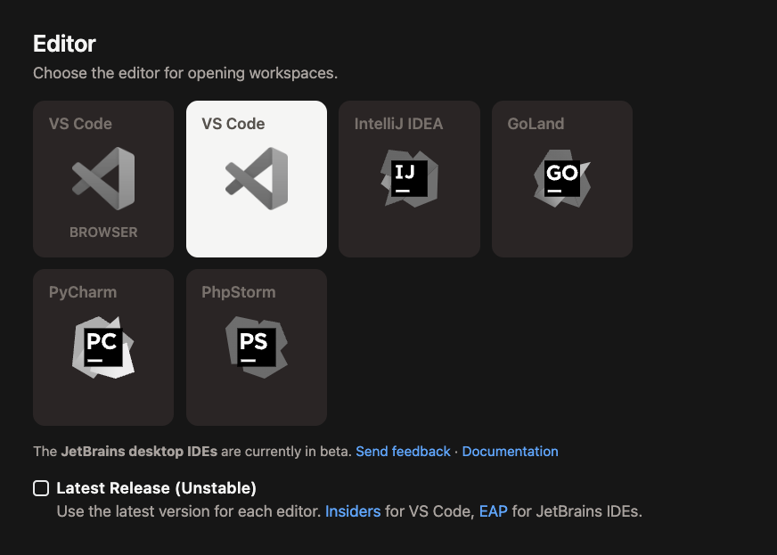
Selecting VS Code Desktop as an editor preferenceSelecting VS Code Desktop as an editor preference

## Connecting to VS Code Desktop
Connection to VS Code Desktop works via a secure tunnel established on the users device. A minor update is required to the users SSH configuration. A directory is created ``~/.ssh/code_gitpod.d``, and an Include statement is added to the main SSH configuration file (``~/.ssh/config``). No other SSH configuration files are read, or written to by Gitpod.

### SSH configuration modifications
The following shows examples of the changes Gitpod makes to a user’s SSH configuration files to establish a connection to Gitpod.

```bash

$ cat ~/.ssh/code_gitpod.d/config
### This file is managed by Gitpod. Any manual changes will be lost.

Host *.vss.gitpod.io
  ...
```

Caption: An example of the directory created`` ~/.ssh/code_gitpod.d`` and included configuration in the auto-generated ``~/.ssh/code_gitpod.d/config`` file.

```bash

$ cat ~/.ssh/config
## START GITPOD INTEGRATION
## This section is managed by Gitpod. Any manual changes will be lost.
Include "code_gitpod.d/config"
## END GITPOD INTEGRATION
```

Caption: Example of the update to the SSH config file in ``~/.ssh/config``.

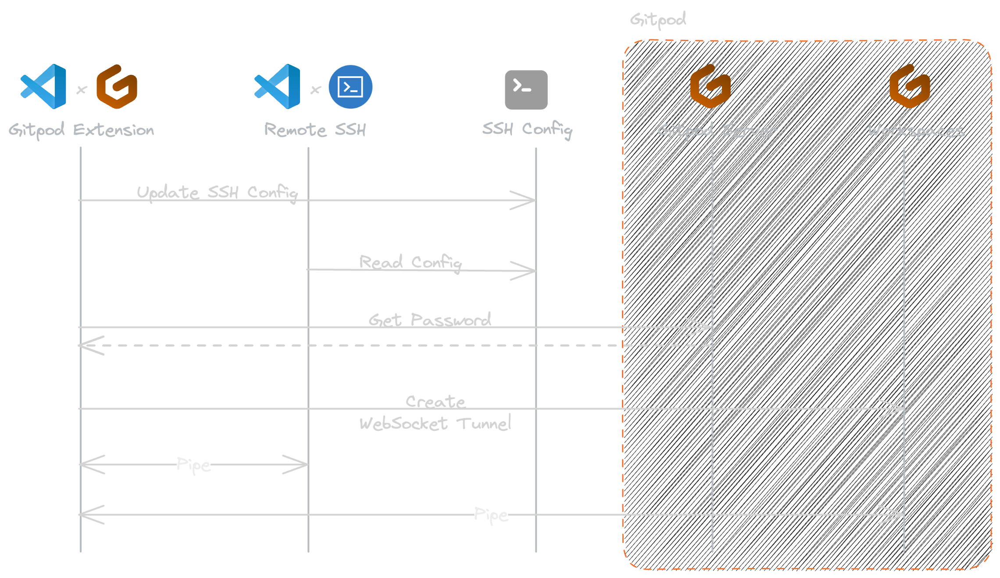

## Legacy Connection Methods
For documentation on previous / deprecated methods of connecting to VS Code see Legacy - VS Code Desktop Connection Methods https://www.gitpod.io/docs/references/ides-and-editors/legacy-vscode-connections , this includes:

1. [SSH Gateway access using an uploaded public SSH key.]([ https://www.gitpod.io/docs/references/ides-and-editors/legacy-vscode-connections#connect-to-vs-code-desktop-using-an-uploaded-public-ssh-key)
2. [SSH Gateway access using the owner token](https://www.gitpod.io/docs/references/ides-and-editors/legacy-vscode-connections#connect-to-vs-code-desktop-using-the-workspace-owner-token)
3. [Using Local Companion](https://www.gitpod.io/docs/references/ides-and-editors/legacy-vscode-connections#connect-to-vs-code-desktop-using-local-companion)
   

### Reconnect to VS Code Desktop
When VS Code Desktop disconnects from the workspace, either you are experiencing genuine connectivity issues, or it’s possible that the workspace has timed out and stopped.

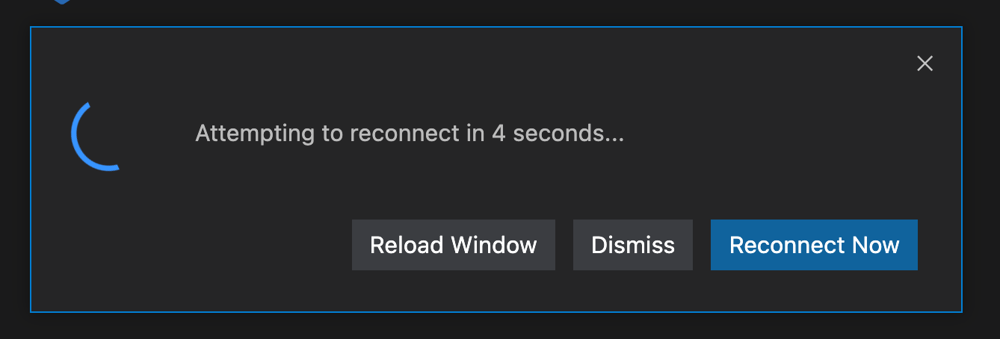


To restart the workspace, click Open Workspace from the workspace start page or from the dashboard and VS Code Desktop should automatically reconnect.

Please note: There is currently no way to start a workspace directly from VS Code Desktop.

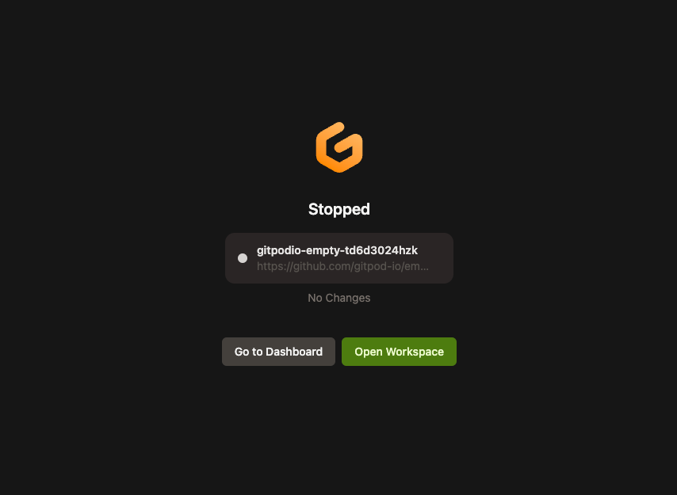

## VS Code settings sync
For enabling Setting Sync in VS Code Desktop please refer to the official VS Code Settings Sync documentation

Notice: Syncing between VS Code Browser and VS Code Desktop is not supported.

## Managing VS Code extensions
VS Code runs extensions in one of two places: locally on the UI / client side, or remotely on your Gitpod workspace.

For further details, please refer to the official VS Code docs on how to manage extensions.

### Custom fonts in VS Code Desktop
The process of installing fonts matches how you typically install custom fonts locally:

1. Download the desired font to your local machine and install it locally on your operating system.
2. Open the editor’s user settings (e.g. File > Preferences > Settings > User)
3. Configure your font with the editor.fontFamily setting:
  
  ```json
  {
    "editor.fontFamily": "Your custom font name"
  }
  ```

jso


### Optimizing VS Code Desktop
If you’re using VS Code Desktop for frequent work you’ll want to optimize your setup. Below are some tips to get a workspace set up as efficient as possible.


### SSH fingerprint
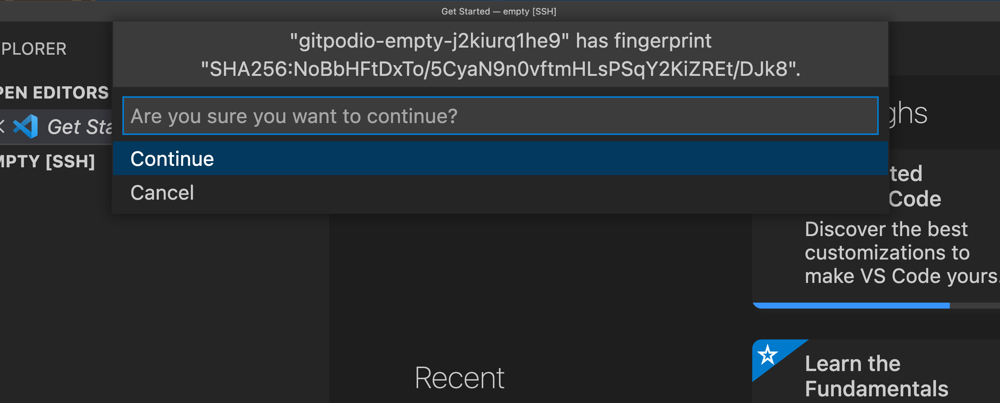


It is common convention to be asked for a fingerprint when accessing a new SSH server. When the fingerprint is accepted, a reference to the server is stored in your local ``known_hosts`` file, which suppresses subsequent SSH connection prompts for that server.

You should only be presented with a request to trust the Gitpod workspace when using the legacy Local Companion approach of connecting to VS Code Desktop.

By swapping to the SSH Gateway approach of accessing VS Code Desktop, your known hosts file will be updated automatically. See connecting to VS Code Desktop for more.

### Workspace Trust
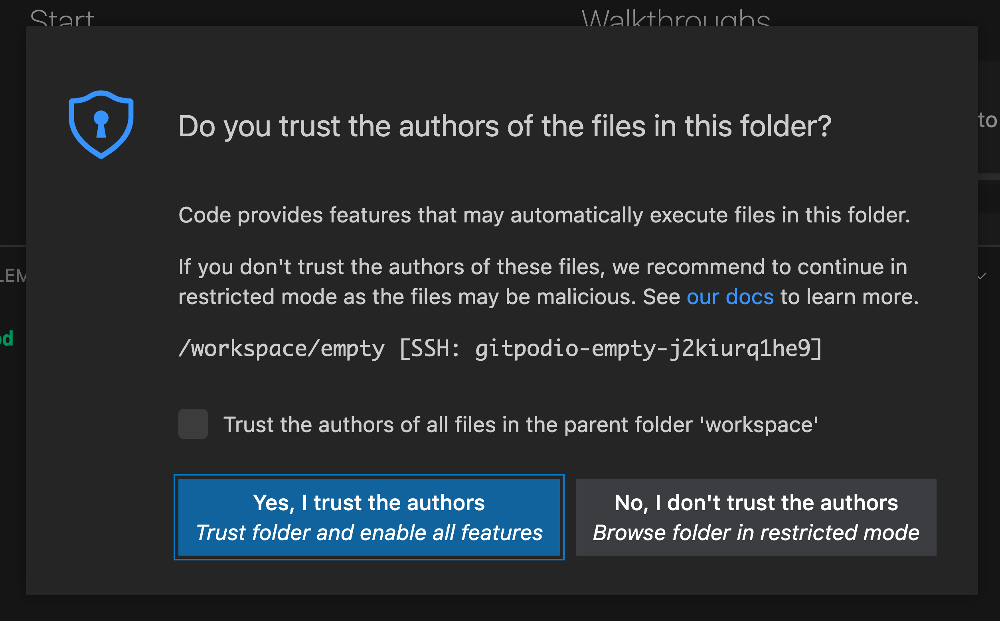


Workspace Trust is a feature within VS Code implemented to help prevent automatic code execution by disabling or limiting the operation of several VS Code features: tasks, debugging, workspace settings, and extensions.

When opening a Gitpod workspace with VS Code Desktop for the first time you will be prompted by a trust modal (given that you have not disabled the workspace trust setting in VS Code).

Selecting ”Yes, I trust the authors” will open the workspace and store a reference to the workspace host and directory. Opening the same workspace will not show the prompt again. However, due to a hostname change, new workspaces require trust to be accepted on first open.

Choosing ”No, I do not trust the authors” will enter you into the VS Code Restricted Mode. You can edit code in your workspace, but some features will be restricted. You can disable the VS Code Restricted Mode after the initial prompt.

If required, you can disable the workspace trust feature, however this is not recommended. Select ”Manage Workspace Trust” from the Manage gear menu to view and modify your VS Code Workspace Trust settings.

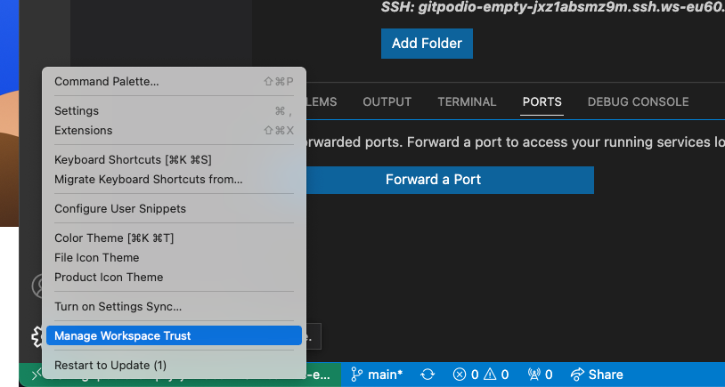

See Workspace Trust in the VS Code official documentation for more.

### How do I know how I’m connecting to VS Code Desktop?
If you’re uncertain about your connection method to Gitpod via VS Code Desktop, you can check the connection host displayed at the bottom left of the VS Code window.

- Recommended - Appears as SSH: <workspaceid>.vss.gitpod.io or SSH: <workspaceid>.vsi.gitpod.io
- SSH Gateway (Legacy) - Shows as SSH: <workspaceid>.ssh.*.gitpod.io
- Local Companion (Retired) - Displays only the <workspaceid> without a domain
- 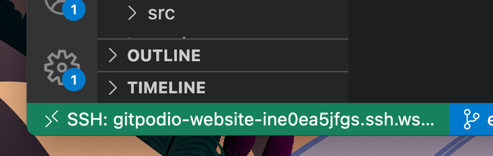
The SSH host information shown in the bottom left of VS Code DesktopThe SSH host information shown in the bottom left of VS Code Desktop

I’m being asked to choose the platform of the remote host. What should I choose?
When connecting, sometimes VS Code Desktop fails to automatically detect the host OS of a Gitpod workspace, asking the following: Select the platform of the remote host "{id}".

No matter what the OS is on your computer, you should always choose Linux as the remote host platform, since this is the operating system all Gitpod workspaces run on.

If you choose another option, you may encounter an error like this:


```text

Resolver error: Error: Got bad result from install script
```

### How do I enable SSH agent forwarding for Desktop VS Code?
Gitpod extension delegates ssh connection to the MS Remote - SSH extension so agent forwarding should just work if you configure it in your ~/.ssh/config file:

```bash
Host *.gitpod.io
    ForwardAgent yes
```

## Upload Files
You can upload files to your workspace by dragging and dropping them into the editor. This method works with every IDE (e.g. Intellij, PyCharm, etc.)


<video width="552" height="310" controls>
  <source src="https://www.gitpod.io/images/editors/file-upload-drag-and-drop.webm" type="video/webm">
  Your browser does not support the video tag.
</video>
Upload Files from local to VS Code Desktop


## Troubleshooting
If you are having issues connecting to VS Code Desktop from Gitpod, try to:

1. Ensure both your VS Code Desktop application and Gitpod VS Code Desktop extension are up-to-date.
2. Determine your current connection method to Gitpod.
3. If you’re not using the recommended mode, switch to it. If you can’t switch, consult the legacy docs.
4. If you’re already using the recommended mode, export the logs from the failed to connect window and email us.