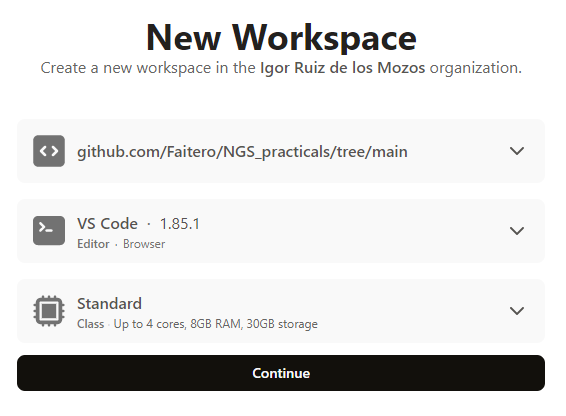
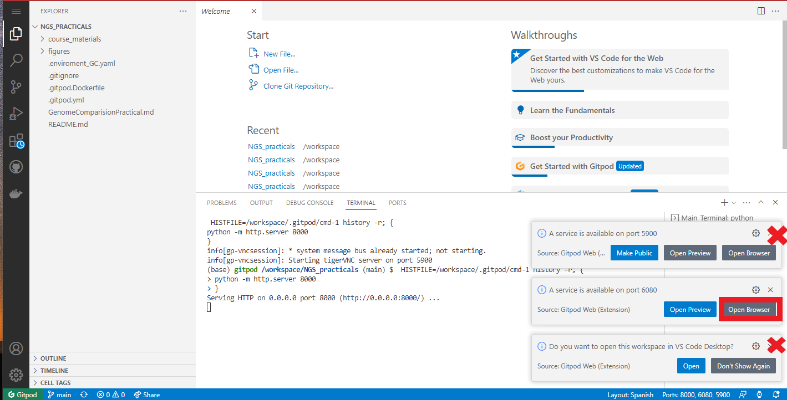
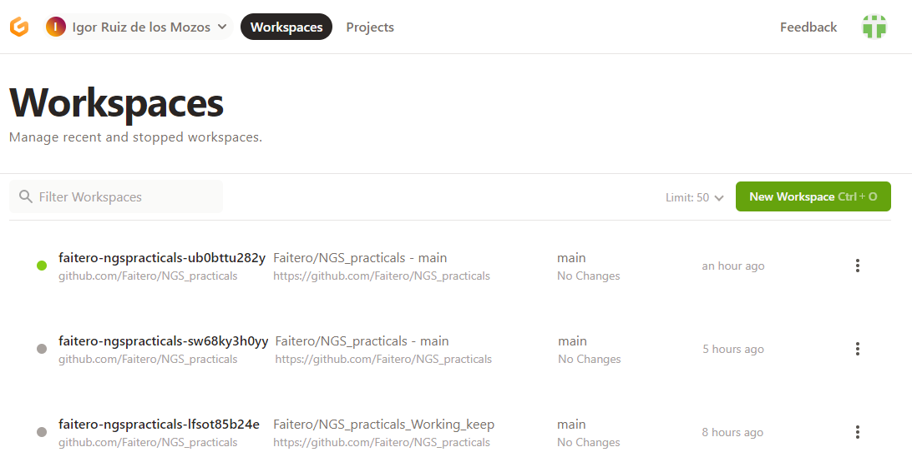

    

    

    

# Introduction to Gitopd cloud environment
  
This classes has been designed to run inside Gitpod cloud environment. To start it, just press the following button:
  

    
You will be redirected to a pop up window, were you require to log in GitHub. After a successful logging, you will be redirected to Gitpod cloud environment. Select the VSCode IDE the Standard machine and continue. 
   

    
The workspace will install and deployed all the requirements to perform the following practical. Once started, **close** tab `A service is available on port 5900` and **close** `Do you want to open this workspace in VS Code Desktop`. In the other hand **Open Browser** `A service is available on port 6080` to open another tab with a visual Desktop that will allow you to navigate visually this computer.

  
Then click on `Main Terminal` to open a command line *bash* interpreter, were you could run the commands explained in this practical.

On the left hand side, you will find a `File Explorer` to interact will all the files from this repository. 

Right click `GenomeComparisionPractical.md` and select **Open Preview**, to display this practical on the file editor section.  

Next time that you want to open this practical, you don´t need to start a new workspace. Just point to https://gitpod.io/workspaces were your previous sessions will be hosted with all the intermediate files produced. Note that if you continue previous workspaces intermediate files will be there, but if you start a new workspace it will be empty (just the initial files proposed)

This button will be on every tutorial to allow you to return to your previous workspace and keep your files.

    

    

 ***