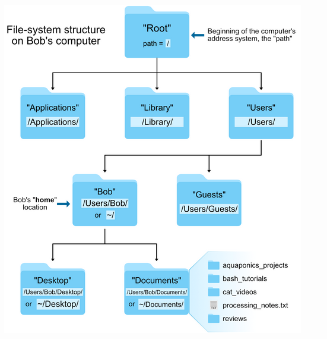

[](https://codespaces.new/FairTeach/codespaces_NGS?quickstart=1)
[](https://github.com/codespaces)

## Welcome

This guide is for students who have never used UNIX or the command line. By the end you should feel confident opening a terminal, moving around the filesystem, inspecting files and editing simple text files. These are the basics required before starting the *NextGenerationSequencingPractical.md* exercise.

We will work inside GitHub Codespaces or Visual Studio Code (VS Code). The screenshots in the original material still apply, but the explanations below aim to be simpler and more explicit.

---

## 1. Understanding the Workspace

- **Terminal vs. Visual Explorer**: The terminal (also called the *shell* or *bash*) lets you type commands. The Explorer panel in VS Code (left-hand sidebar) shows the same folders and files visually, similar to the Desktop view in Windows or Finder on macOS. Switching between them helps you connect what you type with what you see.
- **Folders (directories)** organise files. When you open a codespace the project folder is the “home base”. Inside it you will find folders like `practicals/` that contain the course materials.
- **Current working directory** is the folder the terminal is focused on. Commands run relative to that location. You can always check it with `pwd` (print working directory).

#### Linux system structure



The UNIX filesystem is arranged like an upside-down tree. The `/` directory sits at the top, and everything else branches out underneath. Your course files live under your home folder (`~`), so focus your practice there.

If you prefer a graphical view, you can open the noVNC desktop that ships with this Codespace. In VS Code select the **Ports** tab, find the forwarded port named `Desktop noVNC` (**port 6080**), and click the globe icon to launch the desktop in your browser. From there you can explore folders visually while mirroring the same locations in the terminal.

On the Desktop point to the small arrow on the left corner at the botton and press `File Manager` 


If you are working on your own computer, open the system Desktop/Finder/Explorer window next to the terminal and browse to the same folders. Seeing the folder tree while you run commands helps build intuition.

---

## 2. Opening a Terminal in VS Code

1. In Codespaces or VS Code press **Terminal** on the VSC top bar.
2. A panel opens at the bottom. The shell shown is *bash*; commands in this guide run there.
3. You can keep multiple terminals open using the `+` icon if you need more than one prompt.

```{bash, eval=FALSE}
# Show the folder the terminal is currently in
pwd
```

---

## 3. Essential Navigation Commands

The following commands let you move through folders and list their contents. Try them slowly and cross-check the Explorer panel to see the effect.

```{bash, eval=FALSE}
# Show your current directory
pwd

# List files and folders in the current directory
ls

# List everything, including hidden files (names starting with .)
ls -a

# List files with extra details (permissions, size, dates)
ls -l

# Move into a folder
cd practicals

# Move back up one level (.. means "parent folder")
cd ..

# Jump to the top of the project (home) folder
cd ~

# Combine the above to go straight to a location
cd ~/practicals
```

- `~` represents your home folder (the main project directory in Codespaces).
- `/` at the start of a path is the root of the whole filesystem; avoid deleting things there.
- `.` means the current folder and `..` means the parent folder.

> Tip: Commands are case-sensitive. `Desktop` and `desktop` are different names.

**Keyboard shortcuts that speed things up**

- Press `Tab` while typing a file or folder name to autocomplete it. If more than one match exists, double-tap `Tab` to see the options.
- Use the left and right arrow keys to move the cursor inside the command you are editing, and the up/down arrows to scroll through previous commands.
- `Home` (or `Inicio`) jumps to the beginning of the current line; `End` (or `Fin`) jumps to the end. These are handy when you need to tweak the start or finish of a long command.

To get a quick visual overview of the structure you can use `tree -L 1` (the `-L 1` flag shows only the top level). If `tree` is not installed you can rely on the VS Code Explorer instead.

---

## 4. Creating and Inspecting Folders & Files

You will often need a scratch area to test commands. The steps below create a practice folder and file so you can try later commands safely.

```{bash, eval=FALSE}
# Make a new folder for experiments
mkdir sandbox

# Move into it
cd sandbox

# Create an empty text file
touch notes.txt

# Confirm it exists
ls

# Show what is inside (it is empty for now)
cat notes.txt
```

`echo` prints text to the terminal. Combine it with redirection to populate your file:

```{bash, eval=FALSE}
# Overwrite the file with a first line (> replaces any existing content)
echo "Sample line 1" > notes.txt

# Append another line without removing the existing ones (>> adds to the end)
echo "Sample line 2" >> notes.txt

# Show everything in the file
cat notes.txt

# Preview the first or last lines
head -n 1 notes.txt
tail -n 1 notes.txt

# Combine commands with a pipe (|) to filter results
cat notes.txt | grep "Sample"
```

- `>` sends output to a file and overwrites it; use this when you want to start fresh.
- `>>` appends to the end of the file so you can keep adding notes.
- `grep` searches for matching text; here it keeps only the lines containing "Sample".

Pipes (`|`) let you join commands together. The example above sends the output of `cat` into `grep`. Another handy pattern is to inspect recent commands:

```{bash, eval=FALSE}
# Show the last few commands you ran
history | tail -n 5

# Rerun a previous command by number
!22       # replace 22 with the number shown in the history list

# Rerun the very last command
!!
```

Once you finish experimenting you can tidy up:

```{bash, eval=FALSE}
# Still inside the sandbox folder
rm notes.txt
cd ..          # leave the folder first
rm -r sandbox  # remove the folder and anything in it (be careful!)
```

> Be cautious with `rm -r`. It deletes folders permanently and does not use a recycle bin.

---

## 5. Getting Help While You Work

Most UNIX commands include built-in help so you do not have to memorise everything.

```{bash, eval=FALSE}
# Show a quick summary of options
ls --help

# Read the detailed manual page (press q to quit when finished)
man ls
```

Use `--help` when you want a short reminder. Use `man` (manual) when you need a full explanation with examples. Whenever you see a new command in the practicals, try `command --help` to understand the available flags.

---

## 6. Editing Files in VS Code

Rather than learning terminal-based editors on day one, we will rely on the VS Code editor because it is friendlier for beginners.

1. In the Explorer panel, click the file you want to edit (for example `sandbox/notes.txt`). It opens in a new tab.
2. Make your changes and press `Ctrl+S` (Windows/Linux) or `Cmd+S` (macOS) to save.
3. The terminal updates as soon as you save. For example, `cat notes.txt` shows the new contents.
4. You can also create new files from the Explorer using the **New File** icon.

If you prefer to stay in the terminal, the command `code filename` opens a file directly in the VS Code editor. Example: `code practicals/Intro_into_UNIX.md`.

---

## 7. Useful Everyday Commands

| Command | Purpose | Example |
|---------|---------|---------|
| `clear` | Clean the terminal screen | `clear` |
| `history` | Show recent commands | `history \| tail -n 10` |
| `head` / `tail` | Show the first or last lines of a file | `head -n 5 README.md` |
| `grep` | Search inside files | `grep "FASTQ" NextGenerationSequencingPractical.md` |
| `wc -l` | Count lines in a file | `wc -l data/example.txt` |
| `zless` | View a compressed `.gz` file without extracting | `zless data/reads.fq.gz` |

You will use many of these commands in the sequencing practical. Try them on sample files now so the syntax becomes familiar.

---

## 8. Connecting to the Sequencing Practical

Before starting *NextGenerationSequencingPractical.md* make sure you can:

- Move to the `practicals/` folder with `cd practicals` and list its contents with `ls`.
- Open `NextGenerationSequencingPractical.md` in VS Code to read the instructions.
- Create a working directory for results, for example `mkdir ~/practicals/NGS_results`.
- Use `--help` or `man` when you encounter new tools (e.g. `man grep`).
- Review data files with `head`, `tail`, `cat`, or `zless` so you always know what you are working on.

Take a few minutes to practise each command now. Confidence with these basics will make the sequencing practical smoother and more enjoyable.

---

## 9. Quick Reference

```{bash, eval=FALSE}
# Navigation
pwd
ls
ls -a
ls -l
cd <folder>
cd ..
cd ~

# Create / remove
mkdir <folder>
touch <file>
rm <file>
rm -r <folder>

# Read files
cat <file>
head -n 10 <file>
tail -n 10 <file>
zless <compressed_file.gz>

# Help
<command> --help
man <command>
```

Cheatsheet:

https://devhints.io/bash

Tutorial:

https://www.learnshell.org/

** Complete book:**

https://www.tldp.org/LDP/Bash-Beginners-Guide/Bash-Beginners-Guide.pdf

More advanced tutorial:

https://guide.bash.academy/

Keep this page open the first few times you work in the shell. With repeated use, the commands will become second nature. Happy exploring!
