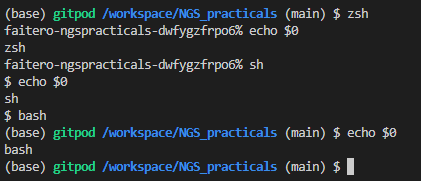
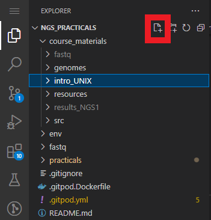
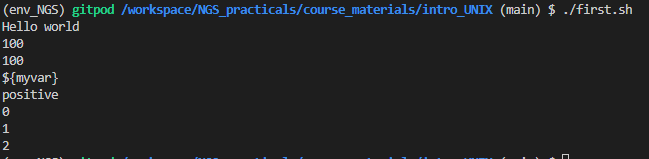
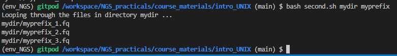
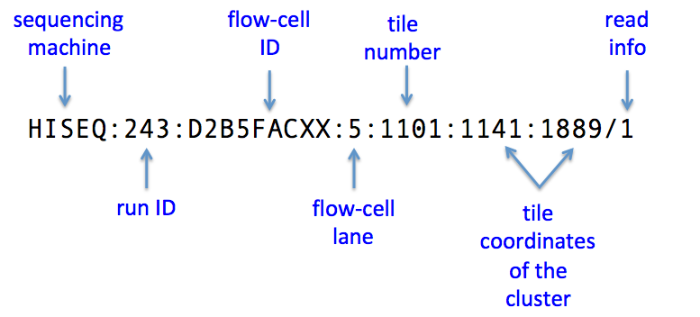
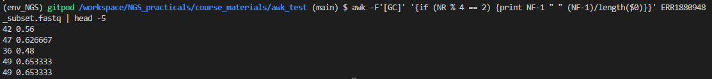
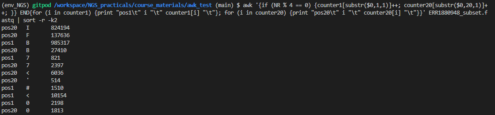

    
[](https://codespaces.new/FairTeach/codespaces_NGS?quickstart=1)

[](https://github.com/codespaces)

# Download files on a web browser

If you encounter some issue to download with command line you could also get file to workout this session. 

### Subset of real ENA data
https://www.dropbox.com/s/mhsfrgl9esx9qdb/ERR1880948_subset.fastq.gz?dl=0


# A short introduction to using the Unix command line
## Who is this document for
This document was written to help students enrolled on the "Análisis e interpretación de datos de alto rendimiento" module of the Máster en Métodos Computacionales en Ciencias, University of Navarra. Also for students on Advanced Bioinformatics module on the Master on Biomedical Engineering, Public University of Navarra.

## What do we mean by the command line?

When we talk about the command line, here, we will mean the shell. The shell is part of the interface between the computer's hardware and you. In reality, a kernel will sit on top of the hardware and the shell is actually the interface between you, the user, and the kernel. The kernel is the ship's commander. It's part of your operating system and has full control over the computer.

We will be using Linux here, which is a version of Unix. Linux has many shells available. Below are a few examples:
* sh (unix shell)
* bash (Bourne Again Shell)
* csh (C shell)
* ksh (Korn shell)
* tcsh
* zsh (on macs)

Each shell is essentially a programming language. It can read and interpret a large number of commands which is why we can type at the command line prompt and have something happen.

bash is somewhat special as it is the default shell for many open versions of Linux. It is also the shell favoured by many bioinformaticians.
    
## What shell are we using on Codespaces

Unix bash is the default shell when you enter our Codespaces emulator. You can find out what the shell you are currently using is by typing:

```{bash, eval = FALSE}
echo $0

```

which should result in the following:


The default for users appears to be the bash but we could change to zsh. zsh has an added functionality version of the c-shell, as is common in unix, because of its ability to auto-complete commands.

It is possible to change shells. The following commands change from zsh to sh an bash and back. Note how the prompt changes with the change of shell.



Many shells understand the same basic commands but differ in some of the syntax for some of the commands. Hence, a script (program) written to run on the zsh will most likely fail on bash and the other way round.

In order to avoid confusion, we shall stick on the command line with the bash as much as we can. If we want to write bash interpretable code, we will write that in a script instead, i.e. in a file that we will make executable and run it with the bash command. We don't have to do things this way. It's just a suggestion for these practicals but you may find that you develop a liking for one of the shells and then learn to use that all the time. It's really up to you.

Before we go on to see how to write a basic bash script, let's learn a few commands that are universal and we can use them pretty much in every shell.
  
## Set up your directory structure and working environment   

We will set a shortcut for the path where we keep the practical work for this set of sessions. We will then create a new directory for this practical and work in that directory.
  
If you have copied the course_materials as suggested in the last practical, you should be able to start the practical. There is one ore thing you can do to make life easier: set a shell variable to point to the parent directory of the course_materials so you don't have to type the full path. The following will work on the default shell, elsewhere and and on Codespaces:

```{bash, eval = FALSE}
# Include environmental variable ToDo
st_path=$PWD
# st_path="/workspaces/codespaces_NGS"

# The order of conda channels is important! Please make sure that you have configured your conda channels prior to installing anything with BioConda:
conda config --add channels defaults
conda config --add channels bioconda
conda config --add channels conda-forge
conda config --set channel_priority strict

# Install MultiQC mamba in base environment for 
mamba install -y -n base multiqc firefox

# Create and load mamba environment with all the tools needed to carry on this practical.
mamba env create -f "${st_path}"/env/.environment_NGS.yaml
# Initialize your shell before using activate and deactivate.
eval "$(mamba shell hook --shell bash)"
# Activate environment
mamba activate env_NGS
# Cleaning index cache
mamba clean --all --yes

```   
  
## Prepare a directory with some files

In order to practice the use of the command line, let's first copy some files to your directories. You will need these files for the NGS practicals. To be able to run and export this lecture over many systems we will use a trick using a variable to substitute the $PATH. I will assume that you are already under `/workspaces/codespaces_NGS` before you follow these commands:


```{bash, eval = FALSE}
# Change and create directory
cd "${st_path}"
mkdir intro_UNIX
cd "${st_path}"/intro_UNIX

# Download fastq sequencing data to use during this practical
wget "https://www.dropbox.com/s/mhsfrgl9esx9qdb/ERR1880948_subset.fastq.gz" -O ERR1880948_subset.fastq.gz

```

## Part 1. Basic common commands for the Linux command line
  
Below are the most popular commands you will need to be familiar with in order to do anything basic in Linux. We will practice them during the practical.
  
* Use `ls` to list the files in a directory. Useful parameters: 
    
```{bash, eval = FALSE}
ls
# show files starting with . (hidden files)
ls -a /workspaces/codespaces_NGS/env
# Note we are not using -a on this command. Could you identify any difference?
ls /workspaces/codespaces_NGS/env
# list files in long format, in reverse chronological order (newest will be last)
ls -lrt
# long listing, in reverse order of size, printing size in human-readable format
ls -lrSh
# For practicality we will use mainly `ll` that is the short version of ls -l
ll
```
  
* Show the current working directory with `pwd`.
  
```{bash, eval = FALSE}
pwd
```
  
* Change to another directory with `cd` and display current working directory with `pwd`.
  
```{bash, eval = FALSE}
# Go to your /home
cd
# Return to  /workspaces/codespaces_NGS/course_materials/
cd "${st_path}"
# Go to folder for this practical
cd intro_UNIX
# Return to upper level same as cd /workspaces/codespaces_NGS
cd ../..
# Display tree Unix structure
tree
```
  
* Make another directory with `mkdir` and list
  
```{bash, eval = FALSE}
cd "${st_path}"/intro_UNIX
mkdir fastq
ls
```
  
* Copy or move files with `cp` and `mv`
  
```{bash, eval = FALSE}
# Download fastq sequencing data to use during this practical
wget "https://www.dropbox.com/s/mhsfrgl9esx9qdb/ERR1880948_subset.fastq.gz" -O ERR1880948_subset.fastq.gz
# list files
ls
# unzip the file
gzip -d ERR1880948_subset.fastq.gz
# copy it to another directory
cp ERR1880948_subset.fastq fastq
cd fastq
# change the name of the file
mv ERR1880948_subset.fastq another_name.fq
ls
```
  
* Delete files / clean up with `rm`
  
```{bash, eval = FALSE}
rm another_name.fq
# what happened? did you get a warning before removal?
ls
cd ..
# Remove directory recursively !THIS CAN BE DANGEROUS!
rm -r fastq  
```
  
* Examining text files with `cat` , `head`, `tail`, `more`, `less`
  
```{bash, eval = FALSE}
# show the first 10 lines only
head ERR1880948_subset.fastq

# grab the first 30 lines and put them in a new file called
# thirtyfirst.fq
head -30 ERR1880948_subset.fastq > thirtyfirst.fq

# show the last 5 lines of thirtyfirst.fq
tail -5 thirtyfirst.fq

# display the whole of the file thirtyfirst.fq on the screen
cat thirtyfirst.fq

# cat goes fast through the file! Use "more" to go page by page
# you can go down a page but not up!
more thirtyfirst.fq
# press the space bar or Enter to move, q to exit

# use "less" so you can scroll back too with page up and down!
less thirtyfirst.fq

```
  

* Use redirection `>` and `<` to send the output of one operation to a file or read from a file
  
```{bash, eval = FALSE}
cat thirtyfirst.fq > second.fq

# if the file exists and you want to overwrite it, use >!
cat thirtyfirst.fq >! second.fq

# if you want to append the results, use >>
cat thirtyfirst.fq >> second.fq
```
  
* Print a series of characters on the screen with `echo`
  
```{bash, eval = FALSE}
echo "Here I am!"
echo "Here I am!" > test
cat test
```
  
* Use `wc` to count the number of lines and words/bytes in a file
  
```{bash, eval = FALSE}
# print newline, word and byte counts
wc thirtyfirst.fq

# -l will give you just the number of lines
wc -l second.fq

# -m will give you the number of characters
wc -m second.fq
```
  

* Use `diff` to find the differences between two text files
  
```{bash, eval = FALSE}
# create two files with different lists of genes
echo -e "gene1\ngene2\ngene3" > t1
echo -e "gene1\ngene2\ngene4" > t2
diff t1 t2
```
  
* Use `grep` to grep patterns in text files using regular expressions
  
```{bash, eval = FALSE}
grep gene3 t1
grep gene4 t1
grep gen t1

# return the number of the line where the pattern was found
grep -n gene3 t1

# do not allow partial matching
grep -w gen t1
# (should return nothing)

# sometimes we are interested more in the line preceding
# or following the line that matches a pattern;
# use -A to get lines after
# and -B to get lines before the match
grep -n -B 1 gene3 t1
# (should get one line before the gene3 line and the gene3 line)

# find lines that do not contain gene3 (prints the other lines)
 grep -v gene3 t1
  
# use quotation marks to ensure the expression is
# interpreted correctly
grep -E 'gene[12]' t1
# (should only print lines starting with gene and having
# at the end numbers 1 or 2)
```
  
* Use a pipe `|` to perform multiple operations, passing the result of one operation to the next.
  
```{bash, eval = FALSE}
echo -e 'Hello world \n I am here'
echo -e 'Hello world \n I am here' | grep -w world 

# a common useful operation is to count lines after a grep
grep gene t1
grep gene t1 | wc -l
```
    
* Some more useful commands: `top`, `history`, `sort`, `uniq`
      
```{bash, eval = FALSE}

# use top to get a dynamic view of the Linux system
# (showing processes managed by the kernel). Exit with q
top
htop
# use history to get the list of commands you have entered
history

# each command is numbered; you can use that number to 
# repeat that command (use ! at the beginning)
# The following repeats command 99
!99

```
    
```{bash, eval = FALSE}
# sort does an alphanumeric sort on its input 
# so sorting a text file will return the lines sorted in alphabetical order; 
echo -e "1gene\n4gene\n3gene\n5gene\n10gene" > sort_example.txt
cat sort_example.txt
cat sort_example.txt | sort
# when you have numbers in the file, you often want numerical sorting instead
cat sort_example.txt | sort -n

# sort is often used together with uniq to get a non-duplicate list
# of lines in a file
echo -e "1gene\n3gene\n4gene\n5gene\n10gene\n3gene\n4gene" >> sort_example.txt
cat sort_example.txt | wc -l
# uniq without sorting is not useful
cat sort_example.txt | uniq | wc -l
# uniq after sorting has the expected behaviour
cat sort_example.txt | sort -n | uniq | wc -l
```
      

## Part 2. Basic bash script writing
  
We will introduce you to some basics so that if you haven't taken bash course yet, you can still do the NGS practicals without major issues. This information should also come handy when you come to do your projects in this term.
  
There are two ways to use bash. One is to invoke the bash shell and type commands on the command line.
  
The other is to put all commands in a script and then run the script. We will focus here on writing such short scripts.

### Using an editor
To write any script in Linux, you will need an editor. You might see me using `vim` (enhanced version of `vi`), a well known and much hated unix editor. I do it out of habit because it was the first unix editor I used. I suggest you use something else. If you work locally on your own machines, use a nice IDE like Visual Studio Code that recognises many languages and has many extensions to help you. I used Visual Studio Code to write this markdown file. However, if you are on a command line in Linux and possibly without access to GUIs, then use something simple like the `nano` or `gedit` editors. If you want something more powerful/complex, you can use `emacs`. All these three editors are installed on the edition you are right now, and they are very likely to be installed on any Linux/unix distribution you come across.

### Your first bash script
Click/select the intro_Unix folder and create a new file (call it `first.sh`) by pressing new file on the VSC file explorer or using one of the editors listed above. Then copy and paste the code given below. 
  

  
```{bash, eval = FALSE}
#!/bin/bash

# Print on screen. Writes its arguments to the standard output
echo "Hello world"

# Create a variable and give it a starting value
# Note: do not use spaces!
# Do not do this: myvar = 100
myvar=100
# not recommended
echo $myvar
# recommended
echo "${myvar}"
# probably not what you want...
echo '${myvar}'

# Control statements - if
# note: indentation is not obligatory like in python
if (( myvar > 0 )); then
    echo "positive"
elif (( myvar == 0 )); then
    echo "zero"
else 
    echo "negative"
fi

# Control statements - loops
counter=0
while (( counter < 3 )); do
    echo "${counter}"
    ((counter ++ ))
done
```
Save the file and exit.

Let's take a look at this basic script.
The first line is known as *shebang*. It starts with the hash sign followed by an exclamation mark and finally the path to a program that can be used to interpret the code in the script. Here, this program is the bash shell and its path is `/bin/bash`.

The next line of code creates a variable `myvar` and sets it to 100. Note that we cannot use spaces, so writing myvar = 100 would not be interpreted correctly (the shell will flag an error). Note also the use of double quotes, curly braces and the dollar sign. The quotes are not strictly necessary here but it's good practice to use them. Single quotes would force everything to be interpreted as a literal string (you'd see *myvar* instead of the value of myvar).

The next chunk of code shows an if statement. Note the use
of `;` to indicate the end of a statement, the use of `elif`
for alternative if and the fact that the statement ends with `fi`.
Note also the comparison within the brackets: using double brackets
and spaces is the recommended way of doing comparisons. 
Bash is a bit messy like this...
Finally, note that we used the bare word myvar for the variable in
the if statement. This is because we do not need to interpolate the variable here within a string context. We simply use it as a variable and bash knows that's what it is, as we defined it earlier on.

The final chunk of code is a while loop. Again, here we use the variable counter without the double quotes and curly braces unless we want to interpret it in a string, as we do with echo. The while loop actions are enclosed within the `do/done` pair of words. 

You can run your script using the following commands:

```{bash, eval = FALSE}
# Check permissions
ll
# Change permissions
chmod a+x first.sh
# (this changes the permissions for the file so that it now becomes
# executable (that's the "x" bit) to all users (that's the "a" bit)). Could you spot the difference?
./first.sh

```
If you don't make the script executable, you can still run it but you need to call the program that runs it (here the bash shell) first:
```{bash, eval = FALSE}
bash first.sh
```

If it works, you should get this (assuming you copied the code exactly):
  

  
### Your second bash script - passing parameters to the script
   
Earlier, we wrote a script that simply runs but reads no input. Often we want to pass on some input to the script so we get different results, depending on the input we give it. 

We will examine here a simple case only where we want to pass some parameters to the script. These may often be file or directory names or they may be a numerical parameter the script needs.

Below is a simple bash script where a directory name and a a prefix used for all files is passed to the script. The script then uses this information to build filenames with which it can do something (here, it simply echoes these names
so we can check we did it correctly but in another context you would want the script to do more with these files, e.g. in typical NGS analysis, you may want the script to run a program on each file separately). In this example, we will also see how we can loop around files in a directory using a `for` loop in bash.

To have something to run the script on, run the following code to create a directory and then create three (empty in this case) files in this directory that are consistently named with the convention: myprefix + underscore + a number + .fq and one file that will be our negative example and that follows a slightly different pattern.

```{bash, eval = FALSE}
mkdir mydir
cd mydir
touch myprefix_1.fq myprefix_2.fq myprefix_3.fq yourprefix_1.fq
cd ..
```

We will invoke the script passing the two parameters on the command line as follows (do not attempt to run before creating the script!):

```{bash, eval = FALSE}
./second.sh mydir myprefix
```

The code for the script *second.sh* is given below:

```{bash, eval = FALSE}
#!/bin/bash

mydir="${1}"
myprefix="${2}"

if [[ -d "${mydir}" ]]; then
    echo "Looping through the files in directory ${mydir} ..."

    for file in ${mydir}/${myprefix}_[0-9].fq; do
        echo "${file}"
    done

else
    echo "ERROR: ${mydir} does not appear to be a directory"
fi

```

Let's take a closer look. First of all, I should clarify that I used mydir and myprefix as the variables in the script because it made sense to use the same name as the arguments I passed. However, they do not need to be named the same. I could have used any other name and the script would have worked just as well.

The first thing we want to do is extract the arguments from the command line and save them as variables in the script. The arguments are saved in a special array and can be accessed using `${1}` for the first argument, `${2}` for the second etc.

The next thing we want to do is check that the directory name is indeed a directory. We do this with the outer `if` statement and the `-d` command. We return an error message, if this is not a directory.

Then, we look for the files in the directory using the pattern described above (we will thus ignore files that do not follow this pattern). The `for` loop is quite similar to the `while` in that it also has a `do/done` block within which all the action happens. Note the use of regular expressions in the condition of the for loop to discriminate between files we want (myprefix) and files we don't (yourprefix, in this case).

If the script works, it should produce the following output:



#### Assigning to variables the result of a unix command
It is possible to assign a variable to the outcome of a unix command. You can use inverted ticks to do this, as in the example below where the result of the `ls` command is passed on to the variable file:
```{bash, eval = FALSE}
#!/bin/bash

for file in `ls *`; do
    echo $file
done

# alternatively, assign the result of a command using =
# here we select only files that end in .sh
echo "*********"
file=`ls *.sh`
echo $file
```

### Practice example
   
Write a bash script (call it "setup_NGS.sh") to do the copying of the course materials to your own space on ` /workspaces/codespaces_NGS/course_materials ` so that if you need to repeat this process (as described above), you can run a script to do it. Your script should take as arguments the file name you want to copy (including its full path) and the directory name where the file is to be saved and it then should do the following:
1. Create a directory named `course_materials` under `"${st_path}"` (assuming the directory exists) and under `course_materials` create a directory called `fastq`.
2. Copy the file `ERR1880948_subset.fastq.gz` to this fastq directory. 
3. Print out the first four lines of the FASTQ file on the screen. HINT: you do not need to unzip the file; the `zcat` command will read the zipped file and work like `cat` would on an unzipped file.
4. Print to the screen how many lines this file has in total and work out how many reads it has, then print out that number too (refer to the pre-recorded video on file formats (specifically, FASTQ files) to find out how to get that information).
   
Make sure that you check whether the directory and file passed as arguments both exist and exit with an error, if they don't.

**HINT** The command `basename` in linux can be used in bash scripts to extract the last part of a file name. Alternatively, you can use string manipulations to extract part of a filename. For details, see here: https://linuxgazette.net/18/bash.html
   
#### SOLUTION (variations are possible!)
    
```{bash, eval = FALSE}
#!/bin/bash

file="ERR1880948_subset.fastq.gz"
mydir="third_folder"
mydir2="course_materials"
mydir3="fastq"

# Download file 
wget "https://www.dropbox.com/s/mhsfrgl9esx9qdb/ERR1880948_subset.fastq.gz?dl=0" -O ERR1880948_subset.fastq.gz

# Create folder
mkdir ${mydir}

if [ -d ${mydir} ]; then
   if [ -f ${file} ]; then
        if [ ! -d ${mydir}/${mydir2} ]; then
           mkdir ${mydir}/${mydir2}
           mkdir ${mydir}/${mydir2}/${mydir3}
        fi
        cp ${file} ${mydir}/${mydir2}/${mydir3}/
        cd ${mydir}/${mydir2}/${mydir3}

        #now extract the part of the filename without the path ahead of it
        myfile=`basename ${file}`
        #an alternative way of extracting the last part is the following
        #using string manipulation
        #myfile=${file##*/}
        echo ${myfile}
        zcat ${myfile} | head -4
        numlines=`zcat ${myfile} | wc -l`
        echo "Number of lines in the file= ${numlines}"
        numreads=$(( numlines/4 ))
        echo "Number of reads in the file= ${numreads}"

   else
        echo "File ${myfile} does not exist"
   fi
else
   echo "Directory ${mydir} does not exist"
fi

```
To run this script just 

```{bash, eval = FALSE}
bash third.sh

rm -r third_folder
```
   
## Part 3. Basic awk
  
In this final part of the practical we will learn the basics of another very useful command, `awk`. Awk is actually a language but it is used on the command line and can be a very useful and extremely powerful tool for manipulating files and easily extracting information off them. What can be achieved with awk, grep and pipes on the command line could sometimes take several lines of python or similar code to achieve. I would strongly recommend you learn some basic use of it and then rely heavily on search engines to find ways to apply awk in more complex situations that you are not familiar with. Personally, I do this all the time.

To start learning awk with a real NGS file, let's start by downloading such a file to your directories. Note that the ftp address and wget should be on the same line even if they are split here on this document.

```{bash, eval = FALSE}
cd "${st_path}"
mkdir awk_test
cd awk_test
# Download whole fastq file
# wget ftp.sra.ebi.ac.uk/vol1/fastq/ERR188/008/ERR1880948/ERR1880948.fastq.gz
# Download ERR1880948 subset
wget "https://www.dropbox.com/s/mhsfrgl9esx9qdb/ERR1880948_subset.fastq.gz?dl=0" -O ERR1880948_subset.fastq.gz

```
  
What we did above was we created a directory called *awk_test*, and then in that directory, we downloaded a file with NGS reads (to be more specific, RNA-seq reads) from a transcriptomics study of Mycobacterium tuberculosis exposed to nitric oxide (the study is by Cortes et al. PMID:28811595 and can be found on ArrayExpress:
https://www.ebi.ac.uk/arrayexpress/experiments/E-MTAB-5557/ )

Start by checking that your file has downloaded properly and can be opened:
  
```{bash, eval = FALSE}
zcat ERR1880948_subset.fastq.gz | head -4
```
  
You should already know what this means: we printed out the contents of the zipped fastq file and extracted the first four rows. 
From now on it will be more convenient to work with the unzipped file:
  
```{bash, eval = FALSE}
gzip -d ERR1880948_subset.fastq.gz
wc -l ERR1880948_subset.fastq
```

If all the above has worked, you should get back *4000000* (*115427620* whole set) as the number of lines in the unzipped file. There are over a million lines in this file!
  
### First steps in awk
  
Awk is very good at extracting information from a text file. You can think of it as a program that examines each line of a file and repeating a number of commands each time (what you would do in python in a while loop that reads input from a file).
  
The most basic statement in awk is `print`. Awk uses curly braces, like C, to group a block of code (in fact, it looks in general a lot like C). Outside the curly braces, you will need the single quotes on either side. You can pass the file name as an argument to awk by putting it at the end of the command like in this example (I used a pipe and the `head` command to stop awk from printing all 1.15 million lines to your screen):
  
```{bash, eval = FALSE}
awk '{print $0}' ERR1880948_subset.fastq  | head -4
```
  
You should now have the same four lines you had before when we used the `zcat` command on the zipped file. Note that we passed an argument to print, namely `$0`. This stands for the whole line being considered. As I pointed out, awk parses the file one line at a time. Hence, the command `print` is repeatedly applied to every line. We could actually leave out $0 in this case and we'll get the same result but it's cleaner to do it this way.
  
Awk, being a programming language, can use conditional statements. We will use an `if` statement below to write an awk command that essentially immitates `grep`. Our aim is to extract all lines starting with a "@" symbol (these are the title lines for each read). 
  
```{bash, eval = FALSE}
awk '{if ($0 ~/^@/) print $0}' ERR1880948_subset.fastq | head -4
```
  
This time, you should get the first 4 reads' titles, not the first 4 lines of the fastq file. How did this happen? We used an if statement inside awk that limited the action of printing to lines that start with "@" (this is what the regular expression inside the curly brackets did).
  
Awk does another action by default: it separates each line into fields. How the line will be separated depends on what *field separator* is used. The default is a single space character (but note that leading and trailing spaces are ignored and chains of spaces are treated as one). We can refer to the fields using the $ sign: $1 is the first field, $2 the second etc. As we noted earlier, $0 is the whole line.
  
```{bash, eval = FALSE}
awk '{if ($0 ~/^@/) print $1}' ERR1880948_subset.fastq | head -4
```
  
You should now have got only the names of the reads and none of the other information following the name. This was possible because the name was separated by a space. 

You can change the field separator to anything you want by setting the `FS` variable and passing that to awk with the `-F` parameter. The example below sets the separator to ":" so that we can extract the flow cell tile numbers and cluster coordinates from the title lines. The image shows where this information can be found:



```{bash, eval = FALSE}
awk -F ":" '{if ($0 ~/^@/) print $5 " " $6 " " $7}' ERR1880948_subset.fastq | head -4
```
  
Note that if you don't explicitly print the spaces between the three variables in the print statement, *print* will simply concatenate all the information into a single string.
It is also possible to have multiple field separators that can be used at once (in other words, any one of them will act as a field separator). For example if you wanted both : and ; to be field separators you would begin the awk statement with:
  
```{bash, eval = FALSE}
# this code does not work - it just shows you how to set the 
# separator to two possible characters
awk -F '[:;]'
```
  
This works because the square brackets are interpreted as they are usually interpreted in regular expressions: they contain all possible options. In addition, it's worth remembering that awk counts the number of fields produced with the field separator and saves that value in a variable called NF. You can access NF within the awk code, if you need to use the number of fields for something.
  
The perfectionists among you will have noticed that this output looks a bit ugly - we still have the read information attached at the end of the line ("/1") because the field separator ":" is not used in the fastq title to separate that out. There are many ways to get rid of this but one you probably should engage with at some point is `sed`, a stream editor that allows you to transform text using regular expressions. We will probably come back to `sed` during next practicals but for the moment, I just use it here briefly to make the output of the above command look better:

```{bash, eval = FALSE}
awk -F ":" '{if ($0 ~/^@/) print $5 " " $6 " " $7}' ERR1880948_subset.fastq | head -4 | sed 's/\/1//'
```
  
The "s" in the sed command stands for substitute and what we are telling sed to do is to substitute occurrences of "/1" with *nothing* using the regular expression delimiters we are used to. Essentially the syntax is: 's/substitute_this/with_that'.
  

### Writing scripts in awk
  
Although it is possible to write complex commands in awk on the command line, sometimes it's useful to be able to write a script and execute it, just as we would in bash. Awk scripts are made up of three parts. The BEGIN (performed once before the main), main (this is the loop that goes through the file) and END (this is the part that is performed once at the end) parts, all enclosed in "{}". The script essentially looks like this:
  
```{bash, eval = FALSE}
BEGIN {# set parameters like the field separator}
{# main part of the script}
END {# end commands}
```
  
The last awk command we wrote in awk could be rewritten as a script like this (we will call the script script.awk and use a text editor to input the code below):
  
```{bash, eval = FALSE}
BEGIN {
    # set the field separator 
    FS = ":"
}
{
    if ($0 ~/^@/) 
        print $5 " " $6 " " $7
}
END {
    #nothing happens here in this case
}
```
  
We can run the script using:
  
```{bash, eval = FALSE}
awk -f test.awk ERR1880948_subset.fastq | head -4 | sed 's/\/1//'
```
  
The output should be identical to what we obtained before.
Note that we can also use the BEGIN and END statements on the actual command line but they make the commands more clunky and possibly harder to read. However, if we want an action repeated once only, then they are necessary.
  
### Next steps in awk
  
In this next part, we will look at slightly more complex awk scripts. One of the very useful awk variables is `NR`. This is the record number, essentially the number of the line currently being processed. In fact, we can use this NR variable to stop awk from processing the full file so we don't have to use the `head` command instead. The following two commands should give identical results:
  
```{bash, eval = FALSE}
awk '{print $0}' ERR1880948_subset.fastq  | head -4 
awk '{if (NR<5) print $0}' ERR1880948_subset.fastq 
```
  
Because NR essentially holds the current line number, we can use it to skip lines. For example, if we wanted only the quality lines printed out, we could select with awk only every 4th line in the file (here again we are printing only the first four results)
  
```{bash, eval = FALSE}
awk '{if (NR % 4 == 0) print $0}' ERR1880948_subset.fastq | head -4
```
  
The use of the modulo sign, %, ensures that only line numbers exactly divisible by 4 will be printed.
  
Finally, one more very useful operation is being able to split a string into its constituents and hold these in an array. The following example shows how you can extract the second position quality score from the fastq file using awk in two different ways:
  
```{bash, eval = FALSE}
awk '{if (NR % 4 == 0) print substr($0, 2, 1) }' ERR1880948_subset.fastq | head -4

```
  
In the first example, we use `substr` to extract the position of interest. The first argument of `substr` is the string we are interested in extracting information from and here it is the whole line. The second argument is the position that we want to start extracting the substring from (note that these positions are 1-indexed, not 0-indexed). Finally, the last argument, 1, gives the number of characters we want extracted. 
  
An alternative way of doing the same thing is splitting the string into an array with `split`. This allows you to split using any field separators you want but in this case obviously we have no real separators, so our separator will be the empty string. Try first the following:
  
```{bash, eval = FALSE}
awk '{if (NR % 4 == 0) split($0, chars, ""); print(chars[1])}' ERR1880948_subset.fastq | head -4
```
  
This actually fails to do what we want. The reason is that a number of commands that follow the if statement are not grouped together as they should have been. Hence, the if is applied only to the first command (split) and the other two commands are treated as separate statements outside the if. This is an issue in languages where blocks of code are decided by the use of things like brackets. The following simple change ensures that the statements are now grouped together as they should:
  
```{bash, eval = FALSE}
awk '{if (NR % 4 == 0) {split($0, chars, ""); print(chars[1])}}' ERR1880948_subset.fastq | head -4
```
  
I hope these examples together with the practice examples below will show you that you can extract a lot of information from your NGS files without the need for any fancy software. 
  
There are a lot more things one could learn about using the command line. I have learned almost everything I know about the command line from searching the internet (although some things I learned from books when the internet was too young to contain such useful things as "Stack Overflow"). I hope you will make the most out of the amazing resources available to you through search engines to improve your command line skills - you will thank me in your first job as bioinformaticians.
  
### Practice example
  
Write awk scripts that will read the RNA-seq fastq file we downloaded and do the following (you can use pipes and other commands, if you wish):
1. For every read in the file, print out the G/C content of the reads (i.e. the number of Gs and Cs out of all base calls for every read). Report your results for the first 5 reads only. To make it even more interesting, report both the count of Gs plus Cs and the percentage GC content per read.
2. Print out the range of quality scores in this file for position 1 in the read (by range, I mean print each unique score once) and print next to each quality score the number of times it's occurring (as you will go over all the reads, this command will take a few seconds to run). Repeat this for position 20 and come to a conclusion about which position has better calls. 
   
   **HINT**: You can use associative arrays in awk (which are what in other languages are known as hashes). You do not need to initiate them but you can: if your hash is called counter, put in your BEGIN statement `delete counter`. Then you can use the counter with non-numerical indices, such as the quality scores here. You can loop through indices using a for loop. A simple for loop in awk can be written as follows: `for (i in counter) {do_something}`.  
   
#### Solution
  
1. I suspect this can be solved in many different ways, including using loops etc. However, there is a neat little way of doing this by using the character you want to count as a field separator and then counting the number fields.
  
```{bash, eval = FALSE}
# report the number of Gs plus Cs per read for first five reads only
awk -F'[GC]' '{if (NR % 4 == 2) print NF-1}' ERR1880948_subset.fastq | head -5

# report percentage of G and Cs per read for first five reads only
awk -F'[GC]' '{if (NR % 4 == 2) {print NF-1 " " (NF-1)/length($0)}}' ERR1880948_subset.fastq | head -5
```
  
Note that NF is the number of fields after separation. You need to print NF-1 because you are not counting the fields but essentially you are counting the separators here. We also used both G and C as separators so effectively we are counting both Gs and Cs at the same time. Now, look at this one-liner and tell me awk is not wonderful.

2. Counting will rely on the use of associative arrays, using as index the score ASCII symbol.

```{bash, eval = FALSE}
awk '{if (NR % 4 == 0) {counter[substr($0,1,1)]++ }} END{for (i in counter) {print i, counter[i]}}' ERR1880948_subset.fastq
# you can also use sort  to sort the result so more common scores appear first
awk '{if (NR % 4 == 0) {counter[substr($0,1,1)]++ }} END{for (i in counter) {print i, counter[i]}}' ERR1880948_subset.fastq | sort -nr -k2
# then compare with position 20
awk '{if (NR % 4 == 0) {counter[substr($0,20,1)]++ }} END{for (i in counter) {print i, counter[i]}}' ERR1880948_subset.fastq | sort -nr -k2
# (you should find that position 20 has overall better scores than position 1)

# or better, combine the two runs into one
# sort in reverse order by the score since we know
# that higher ASCII corresponds to better score
# I added tabs to the printout for readability.
awk '{if (NR % 4 == 0) {counter1[substr($0,1,1)]++; counter20[substr($0,20,1)]++; }} END{for (i in counter1) {print "pos1\t" i "\t" counter1[i] "\t"}; for (i in counter20) {print "pos20\t" i "\t" counter20[i] "\t"}}' ERR1880948_subset.fastq | sort -r -k2

```
  
I got the following output from the last command:
  

    
  

      
You may want to keep track of the total of all scores and compare it to the total number of reads in the file - the two numbers should of course be equal for any position you choose to count scores for.