    
[](https://codespaces.new/FairTeach/codespaces_NGS?quickstart=1)

[](https://github.com/codespaces)

# Next Generation Sequencing practical

This hands-on practical introduces core Next‑Generation Sequencing (NGS) data‑processing workflows used in microbial genomics. You will perform FASTQ quality control, demultiplexing and adapter/quality trimming, and read alignment to a reference genome, then summarise results with MultiQC. The emphasis is on practical command‑line skills and interpreting outputs rather than exhaustive tool theory. 
    
*** 
    
## 1. Set up your directory structure and working environment   

We will set a shortcut for the path where we keep the practical work for this set of sessions. We will then create a new directory for this practical and work in that directory.
If you have copied the course_materials as suggested in the last practical, you should be able to start the practical. There is one ore thing you can do to make life easier: set a shell variable to point to the parent directory of the course_materials so you don't have to type the full path. The following will work on the default shell, elsewhere and and on Codespaces:

```{bash, eval = FALSE}
# Set the path to your workspace
# Include environmental variable ToDo
st_path=$PWD
# st_path="/workspaces/codespaces_NGS"

# The order of conda channels is important! Please make sure that you have configured your conda channels prior to installing anything with BioConda:
conda config --add channels defaults
conda config --add channels bioconda
conda config --add channels conda-forge
conda config --set channel_priority strict

# Install MultiQC mamba in base environment for 
mamba install -y -n base multiqc firefox

# Create and load mamba environment with all the tools needed to carry on this practical.
mamba env create -f "${st_path}"/env/.environment_NGS.yaml
# add the hook to your ~/.bashrc so every new shell is initialized automatically
echo 'eval "$(mamba shell hook --shell bash)"' >> ~/.bashrc
# apply it now in this session
source ~/.bashrc
# Activate environment
mamba activate env_NGS
# Cleaning index cache
mamba clean --all --yes

```   

# An introduction to NGS practical 1

This document was written to help students understand the context of the NGS practical. 

## 2. Background and aim of this practical

We supplied file of NGS genomic reads (*final_merge_synthetic_reads.fq.gz*). This file is in FASTQ format and was created for this practical. The reads are not totally artificial, in the sense that they originate from a real *E. coli* genome but I manipulated the reads for didactic purposes. The practical proceeds to examine and manipulate this file with the aim of aligning those reads to a reference genome (also provided).

  
## 3. Quality control of raw FASTQ files
    
The first step in NGS analysis is always quality control of the raw data available to you. In this case, FastQC is used to produce a report of the quality of the reads in the initial FASTQ file.

Remember that the FASTQ format is the most common format for raw NGS data. It is described in detail here: https://en.wikipedia.org/wiki/FASTQ_format . Remember that fastq files are organised in groups of 4 lines, like the extract shown below:

#### Fastq format    

**fastq** format is the most common format to get the sequencing data back.
  
More info on:  
  
https://en.wikipedia.org/wiki/FASTQ_format
  
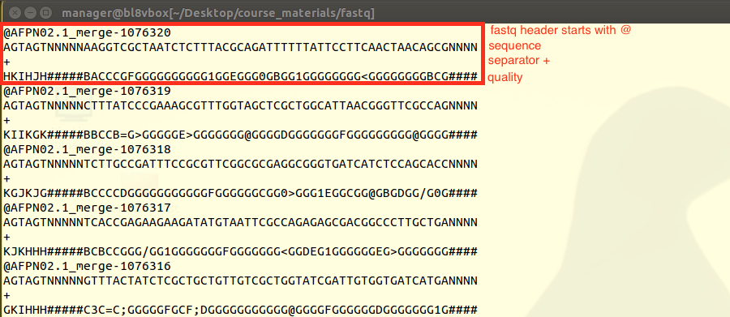  

#### fastq Phred quality expresed in ASCII  

where the quality scores correspond to the following ASCII:

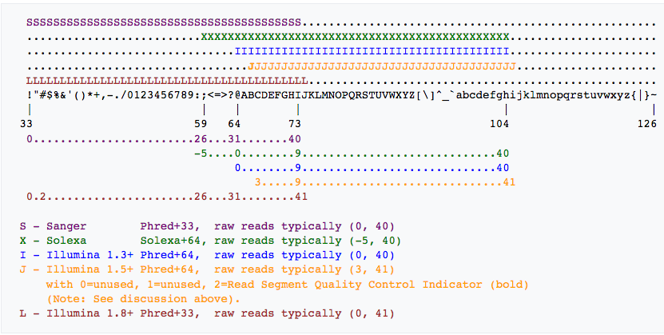 

  
### Download and explore our fastq file  
  
We had improved the initial fastq file. Please, use this version on all the practical:  

https://www.dropbox.com/s/91iqhvmd3ckysju/final_merge_syntetic_reads.fq.gz

  
Check the first few lines of your own fastq file:

```{bash, eval = FALSE}

# Change directory to fastq folder
mkdir -p "${st_path}"/course_materials/fastq/
cd "${st_path}"/course_materials/fastq/


# Download fastq file
wget "https://www.dropbox.com/s/91iqhvmd3ckysju/final_merge_syntetic_reads.fq.gz" -O final_merge_synthetic_reads.fq.gz

# Examine .gz compress fastq file with `zless`. You can advance pages by pressing "space bar". NOTE exit pressing "q" quit!
zless final_merge_synthetic_reads.fq.gz

# Extract reads. Realise that after "gunzip" command the file doesn't end in ".gz".
gunzip final_merge_synthetic_reads.fq.gz

# Examine fastq file with less. Since the file is not compressed anymore we can see it with simple "less"" NOT "zless". NOTE exit pressing "q" quit
less final_merge_synthetic_reads.fq


```


## Quality control of initial file   

    
The first step in NGS analysis is always perform a quality control of the raw data. In this case, **FastQC** is used to produce a report of the the initial fastq file.  
    
**FastQC FAQ:**

**FastQC video explaining all the captured statistics**
https://www.youtube.com/watch?v=bz93ReOv87Y 

[FastQC video](https://www.youtube.com/watch?v=bz93ReOv87Y)

**Good Illumina data**
https://www.bioinformatics.babraham.ac.uk/projects/fastqc/good_sequence_short_fastqc.html
    
**Bad Illumina data**
https://www.bioinformatics.babraham.ac.uk/projects/fastqc/bad_sequence_fastqc.html


    
**FastQC report**
    
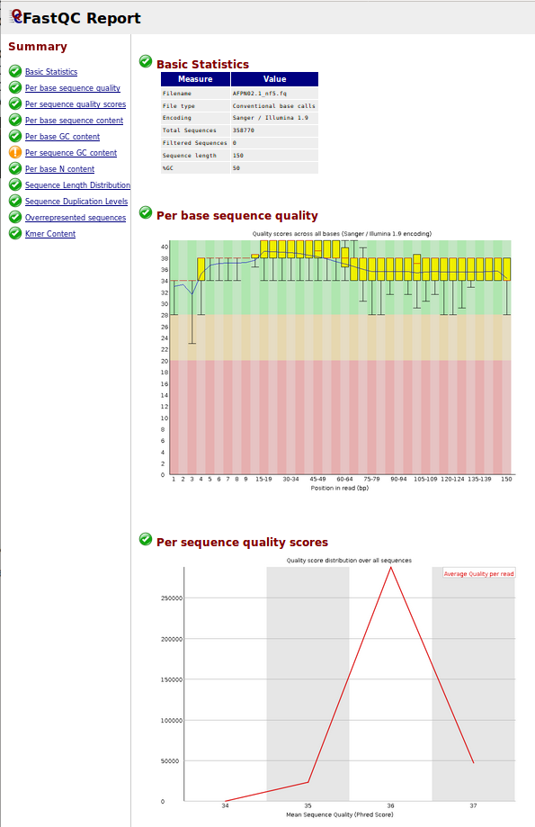   
 
#### Creating our own fastQC report 
    
```{bash, eval = FALSE}
# Change directory
cd "${st_path}"/course_materials/fastq/

####################################################
# FastQC sequencing quality check  
####################################################

# Run FastQC
fastqc final_merge_synthetic_reads.fq 

# Visualise fastQC report in firefox web-browser. NOTE exit with "ctr + c" from the command line.
/opt/conda/bin/firefox final_merge_synthetic_reads_fastqc.html

```
> Open the desktop GUI, or Graphical User Interface, using the port 6080, to visualize the MultiQC report using Firefox browser!! 
> Close the browser with the `X` top right window or `Ctrl + C` to liberate terminal.

     
## 4. Sample de-multiplexing using DNA barcodes 

The FastQC report suggests that there are artificial sequences at the 5' end of these reads, something that can easily verified by checking the reads in the original fastq file. You can most likely work out what these artificial sequences are but sometimes they are given to you; We are providing you here with the barcodes used to separate the samples that have been sequenced in the same lane (this is usually done to save money). There are essentially 4 samples that have been mixed together in the raw data that was provided to you. We give you the barcodes in the guidelines of the practical and calls them **"Long"**, **"Positive"**, **"Negative"**, and **"BQ"**.   
   
In this part of the practical, you are supposed to separate the four samples into four fastq files using the program `cutadapt` and at the same time you are using this program to trim these barcodes off the reads so as to allow mapping of the reads to the reference genome (later on).   
    
#### Demultiplex barcode sequencing data with Cutadapt.    
   
**Cutadapt** removes adapter sequences from high-throughput sequencing reads, demultiplex, process, ** quality trimming**  and modify reads.   
  
NOTE: **We can remove bad quality nucleotides with Cutadapt!!**  

Below is a summary of the main options in cutadapt:

  
```
Cutadapt main parameters

Finding adapters::
  Parameters -a, -g, -b specify adapters to be removed from each read
  (or from the first read in a pair if data is paired). If specified
  multiple times, only the best matching adapter is trimmed (but see the
  --times option). When the special notation 'file:FILE' is used,
  adapter sequences are read from the given FASTA file.

  -a ADAPTER, --adapter=ADAPTER
                      Sequence of an adapter ligated to the 3' end (paired
                      data: of the first read). The adapter and subsequent
                      bases are trimmed. If a '$' character is appended
                      ('anchoring'), the adapter is only found if it is a
                      suffix of the read.
  -g ADAPTER, --front=ADAPTER
                      Sequence of an adapter ligated to the 5' end (paired
                      data: of the first read). The adapter and any
                      preceding bases are trimmed. Partial matches at the 5'
                      end are allowed. If a '^' character is prepended
                      ('anchoring'), the adapter is only found if it is a
                      prefix of the read.
                 
                      
  Additional read modifications:
    -u LENGTH, --cut=LENGTH
                        Remove bases from each read (first read only if
                        paired). If LENGTH is positive, remove bases from the
                        beginning. If LENGTH is negative, remove bases from
                        the end. Can be used twice if LENGTHs have different
                        signs.
    --nextseq-trim=3'CUTOFF
                        NextSeq-specific quality trimming (each read). Trims
                        also dark cycles appearing as high-quality G bases
                        (EXPERIMENTAL).
    -q [5'CUTOFF,]3'CUTOFF, --quality-cutoff=[5'CUTOFF,]3'CUTOFF
                        Trim low-quality bases from 5' and/or 3' ends of each
                        read before adapter removal. Applied to both reads if
                        data is paired. If one value is given, only the 3' end
                        is trimmed. If two comma-separated cutoffs are given,
                        the 5' end is trimmed with the first cutoff, the 3'
                        end with the second.
    --quality-base=QUALITY_BASE
                        Assume that quality values in FASTQ are encoded as
                        ascii(quality + QUALITY_BASE). This needs to be set to
                        64 for some old Illumina FASTQ files. Default: 33
    -l LENGTH, --length=LENGTH
                        Shorten reads to LENGTH. This and the following
                        modificationsare applied after adapter trimming.
    --trim-n            Trim N's on ends of reads.
    --length-tag=TAG    Search for TAG followed by a decimal number in the
                        description field of the read. Replace the decimal
                        number with the correct length of the trimmed read.
                        For example, use --length-tag 'length=' to correct
                        fields like 'length=123'.
                        

```
  
Below is an example of how you can use cutadapt on your data. Note that you cannot call cutadapt without telling the shell where executable file is. To do so, load mamba environment with ` mamba activate env_NGS ` 
  

```{bash, eval = FALSE}
# Change directory
cd "${st_path}"/course_materials/fastq/

# Cutadapt manual
cutadapt --help
    
####################################################
#  Sample multiplexing using DNA barcodes   
####################################################

# Cutadapt run and interpret the output
# NOTE: I have split the command into lines for better
# visibility. You need the back slash immediately followed by end of line
# to indicate to the shell that the command continues on the next line.
# If you put the command in one line, remove the back slashes.

cutadapt -g Positive=^GATACA \
        -g Negative=^AGTAGT \
        -g BQ=^CACACA \
        -g Long=^AAACCC \
        -o trimmed_'{name}'.fq final_merge_synthetic_reads.fq

```
  
Your cutadapt output should look like more or less like this:

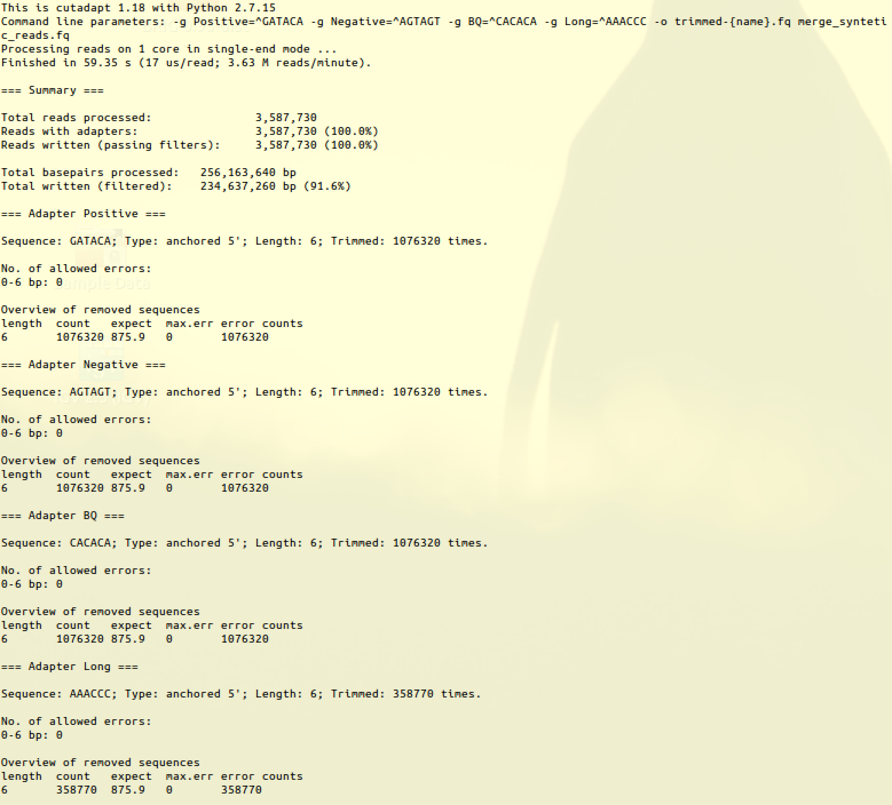   
    
    
## 5. Summarising statistics with MultiQC   
   
**MultiQC** is a very useful program that allows you to summarise statistics that have been produced by a number of other programs. A modular tool to aggregate results from bioinformatics analyses across many samples into a single report. In this part of the practical, we are summarising the **FastQC** output for the merged fastq file, as well as the statistics output by **Cutadapt** after demultiplex or trimming of the reads was carried out.

[ https://multiqc.info/ ](https://multiqc.info/)    

``` {bash, eval = FALSE}
# Manual
/opt/conda/bin/multiqc --help

####################################################
# Summarising statistics with MultiQC 
####################################################
# run multiQC. 
# "." dot means in the current directory and downstream.
# "-f" removing previous results.
/opt/conda/bin/multiqc . -f

# Open in Firefox
/opt/conda/bin/firefox multiqc_report.html


``` 

If this doesn't work you could navigate with the folder system **File System > Computer > workspaces > codespaces_NGS > course_materials > fastq ...**
and open "multiqc_report.html" with Firefox or any other web browser. To select a Web browser, open applications tab on the top left 
corner and select Internet > Google Chrome. Or just drag and drop the multiqc-report to Chrome. 

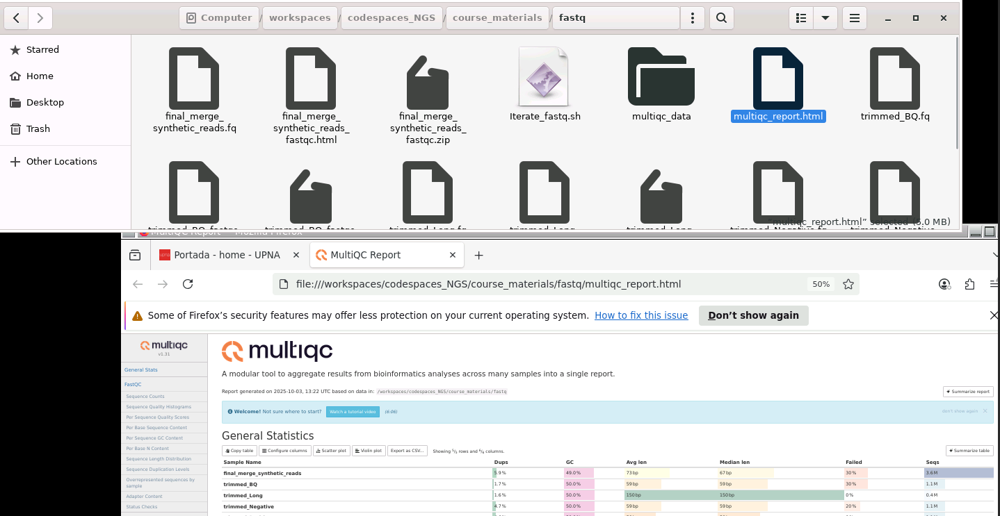  


## 6. Automating repetitive tasks with bash scripts

   
#### Simple bash script     
   
We can create simple scripts on bash to help us and perform routinely tasks. As a follow on, we also runs a **bash shell script** that carries out **FastQC** quality control on each of the demultiplexed samples - separated out from the merged raw data - and re-runs **MultiQ**C at the end on all these outputs. Inspect the "Iterate_fastq.sh" script and learn how you should loop over files in bash.
    
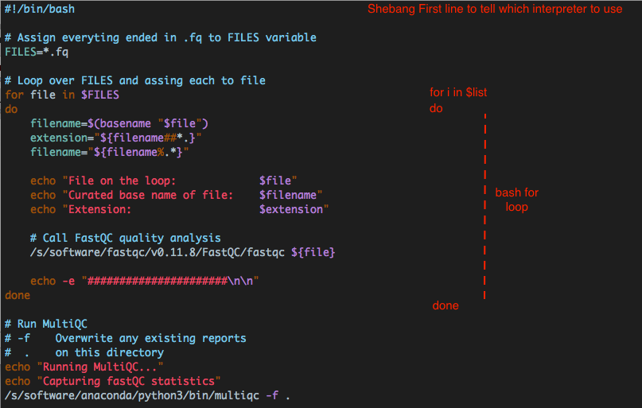    

  

#### Running simple bash script   
    
``` {bash, eval = FALSE}
# Go to folder that stores all Fastq files
cd "${st_path}"/course_materials/fastq/

# Copy resource script
cp "${st_path}"/course_materials/resources/Iterate_fastq.sh .
 
# Inspect simple shell script
less Iterate_fastq.sh

# To iterate FastQC program over all the .fastq files on the current folder and run multiQC wrapper that will search and parse all the NGS output files.
bash Iterate_fastq.sh

# Open multiple FastQC reports on Firefox. Check multiQC report !!! NOTE Close firefox window or "ctr + c" on the command line.
/opt/conda/bin/firefox multiqc_report.html

```

Your multiQC output should look something like this (top of the html page):

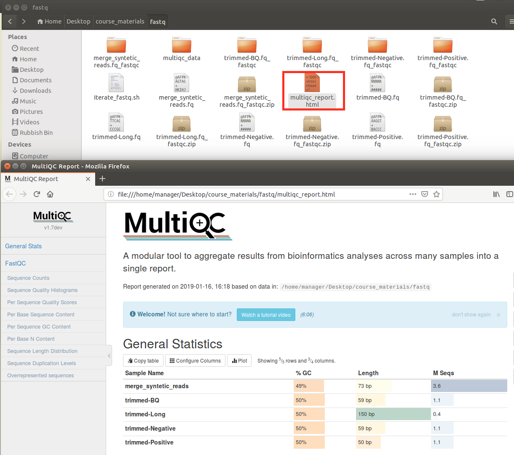   
  
  
     
## 7. Aligning reads to a reference genome with Bowtie2   
    
We have quality-inspected, demultiplexed, quality-inspected again our reads and now finally we arrive to the point when we can align those reads to a reference genome, that of E. coli.

A commonly used program for aligning short reads to a reference genome is **bowtie2**. There are many more such programs: bwa, STAR, hisat2 etc. The new generation of sequencing that produces much longer reads uses its own set of aligners that are more suitable for much longer sequences and sequences that generally also contain a higher error rate compared with Illumina's short reads.

In this practical, we use Illumina short reads and we will map them using bowtie2. This program is installed by mamba, but the latest version can be run by loading  ~~`activate mamba  env_NGS `~~ environment.
     
#### Bowtie2 manual   
    
Information about bowtie2 can be found here: http://bowtie-bio.sourceforge.net/bowtie2/manual.shtml

You can also check the help function of bowtie2 available as is customary with the --help argument:


```{bash, eval = FALSE}
# Bowtie2 manual
bowtie2 --help
```

  
```
Bowtie2 
Usage:
  bowtie2 [options]* -x <bt2-idx> {-1 <m1> -2 <m2> | -U <r>} [-S <sam>]

  <bt2-idx>  Index filename prefix (minus trailing .X.bt2).
             NOTE: Bowtie 1 and Bowtie 2 indexes are not compatible.
  <m1>       Files with #1 mates, paired with files in <m2>.
             Could be gzip'ed (extension: .gz) or bzip2'ed (extension: .bz2).
  <m2>       Files with #2 mates, paired with files in <m1>.
             Could be gzip'ed (extension: .gz) or bzip2'ed (extension: .bz2).
  <r>        Files with unpaired reads.
             Could be gzip'ed (extension: .gz) or bzip2'ed (extension: .bz2).
  <sam>      File for SAM output (default: stdout)

  <m1>, <m2>, <r> can be comma-separated lists (no whitespace) and can be
  specified many times.  E.g. '-U file1.fq,file2.fq -U file3.fq'.

Options (defaults in parentheses):
 Input:
  -s/--skip <int>    skip the first <int> reads/pairs in the input (none)
  -u/--upto <int>    stop after first <int> reads/pairs (no limit)
  -5/--trim5 <int>   trim <int> bases from 5'/left end of reads (0)
  -3/--trim3 <int>   trim <int> bases from 3'/right end of reads (0)
  
Alignment:
  -N <int>           max # mismatches in seed alignment; can be 0 or 1 (0)
  -L <int>           length of seed substrings; must be >3, <32 (22)
  -i <func>          interval between seed substrings w/r/t read len (S,1,1.15)
  ...
  --end-to-end       entire read must align; no clipping (on)
   OR
  --local            local alignment; ends might be soft clipped (off)
  
 Presets:                 Same as:
  For --end-to-end:
   --very-fast            -D 5 -R 1 -N 0 -L 22 -i S,0,2.50
   --fast                 -D 10 -R 2 -N 0 -L 22 -i S,0,2.50
   --sensitive            -D 15 -R 2 -N 0 -L 22 -i S,1,1.15 (default)
   --very-sensitive       -D 20 -R 3 -N 0 -L 20 -i S,1,0.50

  For --local:
   --very-fast-local      -D 5 -R 1 -N 0 -L 25 -i S,1,2.00
   --fast-local           -D 10 -R 2 -N 0 -L 22 -i S,1,1.75
   --sensitive-local      -D 15 -R 2 -N 0 -L 20 -i S,1,0.75 (default)
   --very-sensitive-local -D 20 -R 3 -N 0 -L 20 -i S,1,0.50

 Reporting:
  (default)          look for multiple alignments, report best, with MAPQ
   OR
  -k <int>           report up to <int> alns per read; MAPQ not meaningful
   OR
  -a/--all           report all alignments; very slow, MAPQ not meaningful
  
  
```
    
#### Understanding local vs end-to-end alignment

Reference: http://gensoft.pasteur.fr/docs/bowtie2/2.1.0/#end-to-end-alignment-versus-local-alignment

Similarly to global vs local alignments you came across in the Sequence Analysis and Genomics module, bowtie2 can carry out alignments that are either "end-to-end" or "local". See the examples below for the meaning of these two types of alignment in the context of bowtie2.

```
~End-to-end alignment example~

The following is an "end-to-end" alignment because it involves all the characters in the read. Such an alignment can be produced by Bowtie2 in either end-to-end mode or in local mode.

Read:      GACTGGGCGATCTCGACTTCG
Reference: GACTGCGATCTCGACATCG

Alignment:
  Read:      GACTGGGCGATCTCGACTTCG
             |||||  |||||||||| |||
  Reference: GACTG--CGATCTCGACATCG

~Local alignment example~

The following is a "local" alignment because some of the characters at the ends of the read do not participate. In this case, 4 characters are omitted (or "soft trimmed" or "soft clipped") from the beginning and 3 characters are omitted from the end. This sort of alignment can be produced by Bowtie 2 only in local mode.

Read:      ACGGTTGCGTTAATCCGCCACG
Reference: TAACTTGCGTTAAATCCGCCTGG

Alignment:
  Read:      ACGGTTGCGTTAA-TCCGCCACG
                 ||||||||| ||||||
  Reference: TAACTTGCGTTAAATCCGCCTGG

```
  
#### Create Bowtie2 genome index  

In general, aligners like bowtie2 require the indexing of the reference genome in order to speed up the alignment process (remember: there are millions of short sequences to align against potentially billions of letters in a genome). Bowtie2 is no exception. Thus, the first step before aligning the reads is to index the reference genome. The code below shows how this is done.
    
```{bash, eval = FALSE}
# Change directory
cd "${st_path}"/course_materials/genomes/AFPN02.1

# Create Bowtie2 genome index
bowtie2-build AFPN02.1_merge.fasta AFPN02.1_merge

```

If you built the index successfully, you should end up with several .bt2 files in the directory course_materials/genomes/AFPN02.1/.


#### Aligning sequencing reads to the reference genome using Bowtie2.

The steps below align the separated and trimmed reads to the reference genome, one file at a time.

Create a directory to keep the results of the alignment
This directory will be created under your $st_path directory

```{bash, eval = FALSE}

# Change and create directory
cd "${st_path}"/course_materials/
mkdir results_NGS1
cd "${st_path}"/course_materials/results_NGS1

####################################################
# Aligning with Bowtie2 the four demultiplexed files
####################################################

# Align with Bowtie2
# Align trimmed_Long.fq reads
# --all           # Report all alignments; very slow, MAPQ not meaningful
# --end-to-end    # Align with end-to-end setting
# -x              # Bowtie2 index path
# -U              # fastq file path
# -S              # Output as sam file
# 2>              # Redirect error output to file in bash 

# Align trimmed_BQ.fq reads
bowtie2 --all --end-to-end -x "${st_path}"/course_materials/genomes/AFPN02.1/AFPN02.1_merge -U "${st_path}"/course_materials/fastq/trimmed_BQ.fq -S BQ.sam 2> BQ_bowtie_stats.txt

# Align trimmed_Long.fq reads
bowtie2 --all --end-to-end -x "${st_path}"/course_materials/genomes/AFPN02.1/AFPN02.1_merge -U "${st_path}"/course_materials/fastq/trimmed_Long.fq -S Long.sam 2> Long_bowtie_stats.txt

# Align trimmed_Negative.fq
bowtie2 --all --end-to-end -x "${st_path}"/course_materials/genomes/AFPN02.1/AFPN02.1_merge -U "${st_path}"/course_materials/fastq/trimmed_Negative.fq -S Negative.sam 2> Negative_bowtie_stats.txt

# Align trimmed_Positive.fq reads
bowtie2 --all --end-to-end -x "${st_path}"/course_materials/genomes/AFPN02.1/AFPN02.1_merge -U "${st_path}"/course_materials/fastq/trimmed_Positive.fq -S Positive.sam 2> Positive_bowtie_stats.txt

```

#### Explore Bowtie2 alignment results. 

Do you see differences between the statistic of aligned positive and negative samples?

```{bash, eval = FALSE}
ls -l
head Positive_bowtie_stats.txt
head Negative_bowtie_stats.txt

```

#### run MultiQC to capture all the Bowtie2 alignment statistics.

```{bash, eval = FALSE}
/opt/conda/bin/multiqc . -f

# Open in Firefox and explore mapping results. 
# Are you able to map negative or BQ samples? 
# Why? Check fastQC statistics of negative or BQ samples in comparison with Positive or Long samples.
# Can you improve mapping trimming reads using previous steps? or even using Bowtie2?
/opt/conda/bin/firefox multiqc_report.html

```

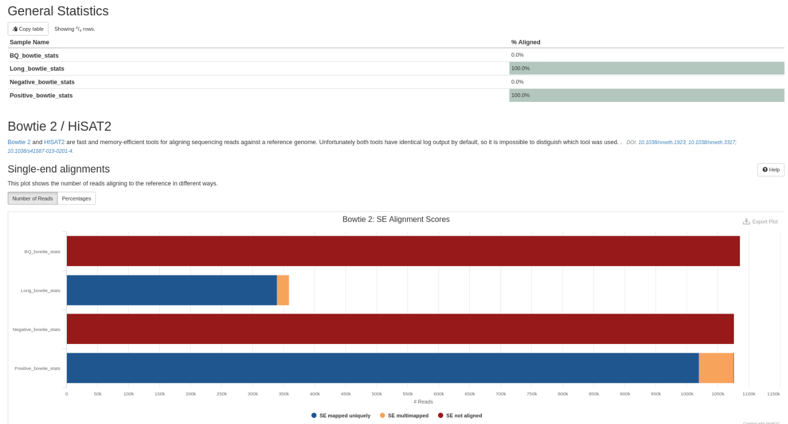   
  
> #### Think about the following questions:
  Are you able to map negative or BQ samples?
  If not, why not? Check fastQC statistics of negative or BQ samples and compare them with Positive or Long samples.
  Can you improve the mapping by trimming reads or by using Bowtie2 alone?


## 8. SAM Sequence Alignment/Map format
  
     
Programs that map NGS reads produce SAM formatted files; this is a format where each read is shown together with information on where it was mapped, if it was mapped at all and with what quality scores each base in the sequence was mapped. Often, these SAM-formatted files are zipped in a special way that produces a binary format equivalent to SAM, known as BAM. You can view and edit SAM files with normal text editors and shell commands that can be used on text files but you cannot view BAM files this way. This is where programs like samtools are handy. samtools is a program that allows you to view and manipulate easily SAM and BAM files.

You can read more about the SAM specification here: https://samtools.github.io/hts-specs/SAMv1.pdf . You can see that your files have several lines starting with @ which represent the header section,followed by one line per read, which represent the records in the SAM file. The image below shows the parts of a SAM record:

   
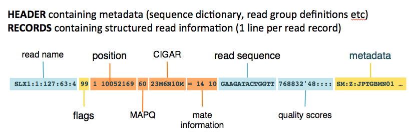   

Lets explore the aligned ".sam" files using the simple head or less command:

Explanation of sam header. **Try to identify read name, flags, position, MAPQ, CIGAR, read sequence, quality scores and metadata in your data**. Can you see any difference in the reads coming from Positive and negative samples? What they have at the 5' and 3' ends? 

**Do you see differences between aligned Positive and Negative samples?**

```{bash, eval = FALSE}   

####################################################
# Explore sam flat text aligned reads output
####################################################

head -n 10 Positive.sam
head -n 10 Negative.sam
 
```      
     
      
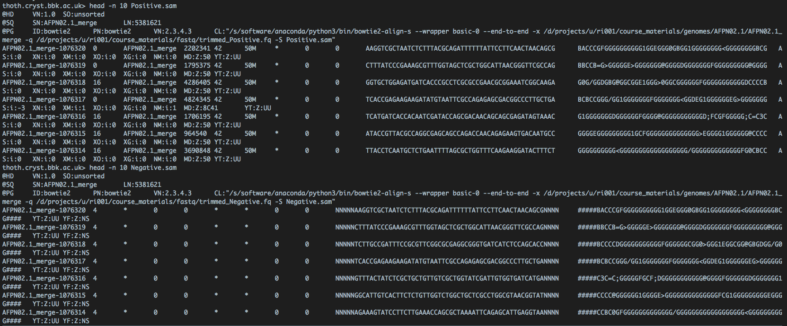    

   

#### Exploring samtools further     
    
The manual for **samtools**, a suite of programs for exploring high-throughput sequencing data in SAM/BAM formats is here:
  
[http://www.htslib.org/doc/samtools.html](http://www.htslib.org/doc/samtools.html)

Try out the code below to explore samtools - each of the commands following samtools is a keyword directing samtools towards a different functionality.

```{bash, eval = FALSE}

# Samtools manual
samtools --help

# samtools FILTER reads manual
samtools view --help

# samtools sort manual 
samtools sort --help

# samtools stats manual
samtools stats --help

```

#### "Samtools view" main usage:
      
```
samtools view main usage
Usage: samtools view [options] <in.bam>|<in.sam>|<in.cram> [region ...]

Options:
  -b       output BAM
  -C       output CRAM (requires -T)
  -1       use fast BAM compression (implies -b)
  -u       uncompressed BAM output (implies -b)
  -h       include header in SAM output
  -H       print SAM header only (no alignments)
  -c       print only the count of matching records
  -o FILE  output file name [stdout]
  -U FILE  output reads not selected by filters to FILE [null]
  -t FILE  FILE listing reference names and lengths (see long help) [null]
  -L FILE  only include reads overlapping this BED FILE [null]
  -r STR   only include reads in read group STR [null]
  -R FILE  only include reads with read group listed in FILE [null]
  -q INT   only include reads with mapping quality >= INT [0]
  -l STR   only include reads in library STR [null]
  -m INT   only include reads with number of CIGAR operations consuming
           query sequence >= INT [0]
  -f INT   only include reads with all  of the FLAGs in INT present [0]
  -F INT   only include reads with none of the FLAGS in INT present [0]
  -G INT   only EXCLUDE reads with all  of the FLAGs in INT present [0]
  -s FLOAT subsample reads (given INT.FRAC option value, 0.FRAC is the
           fraction of templates/read pairs to keep; INT part sets seed)
  -x STR   read tag to strip (repeatable) [null]
  -B       collapse the backward CIGAR operation
  -?       print long help, including note about region specification
  -S       ignored (input format is auto-detected)
      --input-fmt-option OPT[=VAL]
               Specify a single input file format option in the form
               of OPTION or OPTION=VALUE
  -O, --output-fmt FORMAT[,OPT[=VAL]]...
               Specify output format (SAM, BAM, CRAM)
      --output-fmt-option OPT[=VAL]
               Specify a single output file format option in the form
               of OPTION or OPTION=VALUE
  -T, --reference FILE
               Reference sequence FASTA FILE [null]
  -@, --threads INT
               Number of additional threads to use [0]
               

```
    
#### Manipulate aligned data in the sam format  
    
The code below transforms sam to bam (a compressed format of sam), indexes the bam file (required by many programs, e.g. genome viewers) and retrieves some more statistics of aligned sequences using samtools. NOTE: you could rewrite this as a script that runs through all the .sam files and carries out the same process on each one. **Samtools** 
  
```{bash, eval = FALSE}
cd "${st_path}"/course_materials/results_NGS1/
ls -l

####################################################
# Samtools aligned data exploration 
####################################################
# BQ.sam
# sort and compress
samtools sort BQ.sam > BQ.bam      
# create index
samtools index BQ.bam         
# alignment statistics
samtools stats BQ.bam > BQ_stats.txt  
# simple statistics
samtools flagstat BQ.bam > BQ_flagstat.txt     


# Long.sam
samtools sort Long.sam > Long.bam
samtools index Long.bam
samtools stats Long.bam > Long_stats.txt
samtools flagstat Long.bam > Long_flagstat.txt


# Negative.sam
samtools sort Negative.sam > Negative.bam
samtools index Negative.bam
samtools stats Negative.bam > Negative_stats.txt
samtools flagstat Negative.bam > Negative_flagstat.txt


# Positive.sam
samtools sort Positive.sam > Positive.bam
samtools index Positive.bam
samtools stats Positive.bam > Positive_stats.txt
samtools flagstat Positive.bam > Positive_flagstat.txt

```


#### Capture all the statistic and data produced during this practical  using MultiQC

```{bash, eval = FALSE}
# Change directory
cd "${st_path}"/course_materials/

####################################################
# Final MultiQC capturing all the data
####################################################
# Run MultiQC on the initial folder
/opt/conda/bin/multiqc . -f

# Inspect MultiQC report
/opt/conda/bin/firefox multiqc_report.html
```
  

## 9. Visualising alignments on a genome viewer with IGV

The Integrative Genomics Viewer (IGV) is a high-performance visualization tool for interactive exploration of large, integrated genomic datasets. It supports a wide variety of data types, including array-based and next-generation sequence data, and genomic annotations.  

After you have created sorted, indexed BAM files (for example `Positive.bam`, `Positive.bam.bai`), you can inspect the alignments using IGV (Integrative Genomics Viewer). Below are quick instructions for both the desktop IGV and IGV-Web approaches.

### IGV Desktop manual load

1. Start the IGV desktop application by typing `igv` on your terminal.
2. In IGV, set the genome to the reference you used (you can load a FASTA for a custom genome). 
**Genomes > load genome from file > select path** `"${st_path}"/course_materials/genomes/AFPN02.1" and fasta sequence "AFPN02.1.fasta"`.
3. **File > Load from File...** and select the `*.bam` files (IGV will automatically use the matching `.bai`).
4. Navigate to regions of interest, zoom in/out, and inspect read coverage, mismatches and soft-clipping.

Tips: enable "Show center line" and "Color alignments by" (strand or insert size) to make patterns easier to spot.

### IGV Desktop automatic load

This section is intended to automatically load the genome and reads to quickly demonstrate in class the alignments.

```{bash, eval = FALSE}

# Load genome reference file "AFPN02.1_merge.fasta"
# Go to genome locus "AFPN02.1_merge:2397587"
# Load Long and Positive aligned data to IGV. 
igv --genome "${st_path}"/course_materials/genomes/AFPN02.1/AFPN02.1_merge.fasta "${st_path}"/course_materials/results_NGS1/Long.bam --locus "AFPN02.1_merge:2397587" "${st_path}"/course_materials/results_NGS1/Positive.bam


```

### What to look for

- Coverage depth and uneven coverage regions
- Soft-clipped bases and insertions/deletions in the CIGAR strings
- Strand bias and read pair orientation issues
- Clusters of mismatches indicating true variants or systematic errors

A short visual inspection with IGV often clarifies mapping problems seen in summary statistics, and helps decide if further trimming or parameter changes are needed for better alignment.


  
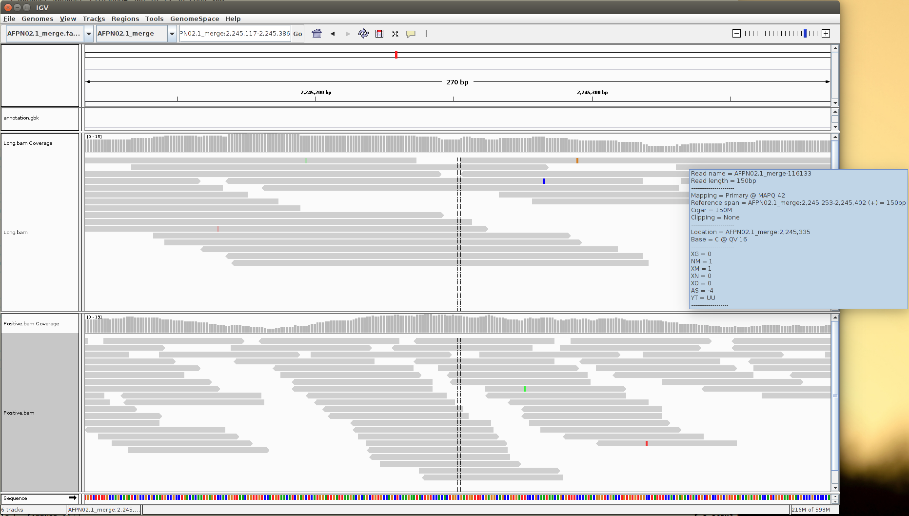 
    
#### Browse aligned reads region ` AFPN02.1_merge:22397537-2399083 `
  
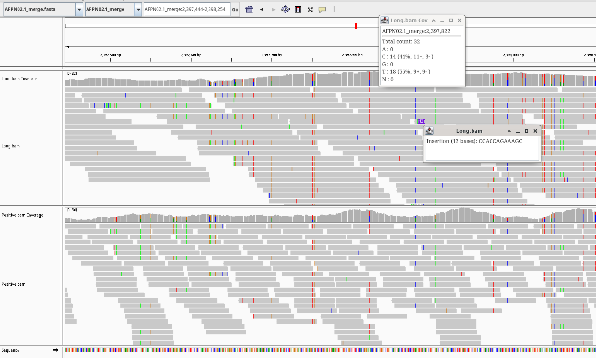 
    

## 10. Get consensus sequence with freebayes   
    
Very easy to run for simple SNP calling. Does not assume any ploidy.    
      
```{bash, eval = FALSE}
cd "${st_path}"/course_materials/results_NGS1/

####################################################
# Get consensus sequence merging all the variants 
####################################################
freebayes -f "${st_path}"/course_materials/genomes/AFPN02.1/AFPN02.1_merge.fasta -p 1 Long.bam > Long.vcffile
vcf2fasta -f "${st_path}"/course_materials/genomes/AFPN02.1/AFPN02.1_merge.fasta -P 1 Long.vcffile -p AFPN02.1_consensus.fasta

# Rename file to more precise name
mv AFPN02.1_consensus.fastaunknown_AFPN02.1_merge:0.fa AFPN02.1_merge_consensus.fa

# Read VCF file
less Long.vcffile

# Read fasta file
less AFPN02.1_merge_consensus.fa

# alternative not used
# samtools mpileup -uf "${st_path}"/course_materials/genomes/AFPN02.1/AFPN02.1_merge.fasta Long.bam | bcftools view -cg | vcfutils.pl vcf2fq > CONSENSUS.fq


```


